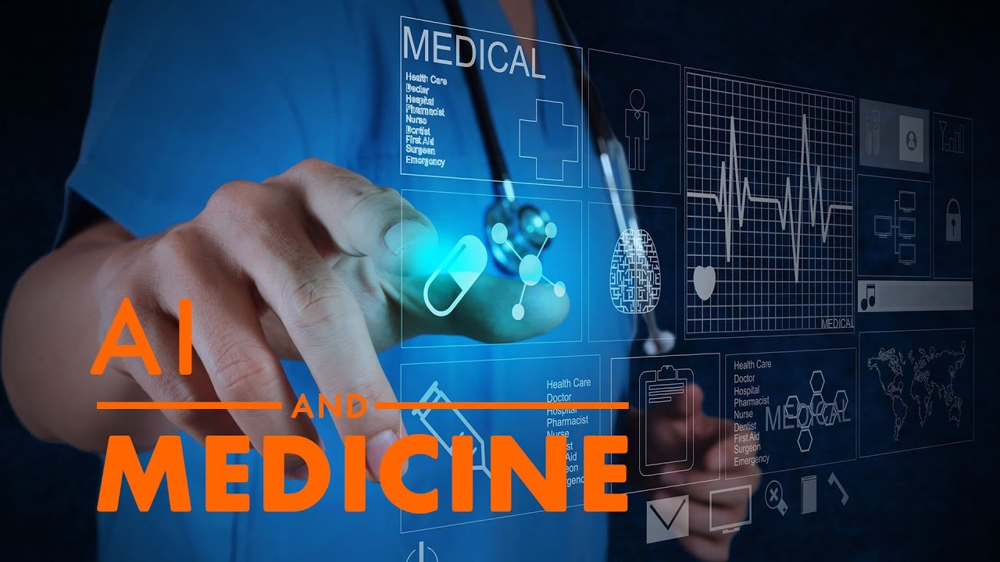

Hi Gators! Here is the **welcome** from Intelligent Critical Care Center(IC3).

With last decade's efforts, we have gained much experience in combining AI with clinical research. We have completed many interesting projects and developed tons of intelliegnt pipelines, service and applications. We also published many featured papers and collected hundreds of citations.

However, it's hard to record and transfer the knowledge. The purpose of this online documentation is trying to record and share the knowledge between researchers. 

The documentation service is built with [Docusaurus](https://docusaurus.io/) and maintained by IC3 DevOps. 

We hope everyone could find the answers for workflows, technical issues, datasets and projects progress easily and fit into the family with minimum efforts.

