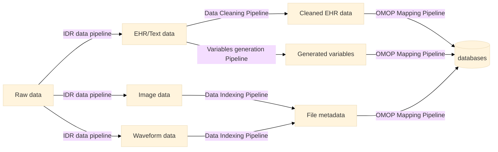

import Image from '@theme/IdealImage';
import DatabaseCards from '@site/src/components/DatabaseCards';
import TimelineComponent from '@site/src/components/DatasetsTimelineComponent';

Datasets are the most important resources we have gained and maintained. Different datasets have various subjects, features and outcomes. 
Understand the datases by reading the datasets descriptions, data dictionaries and data workflows will always be the first step to start the research.   

## Datasets Statistics
<DatabaseCards/>

## Datasets Workflow
IC3 data core takes the responsibility to **manage** the data collected from UF-IDR(Integrated Data Registry). All data will be processed and stored with below brief workflow. 

Researchers are recommended to **query the structured databases** and download the sub-cohort for each project.  
Please feel free to contact with [IC3 data core](mailto:ziyuan.guan@ufl.edu,shickelb@ufl.edu,Tezcan.OzrazgatBaslanti@medicine.ufl.edu) about any datasets problems.

Overall Data Workflow

<Image img={require('./workflow.png')} />

## Datasets Core Concepts
Please read the [key concepts](/docs/datasets/core_concepts) of the datasets before stepping into the data.

## Datasets Plan

<TimelineComponent />

