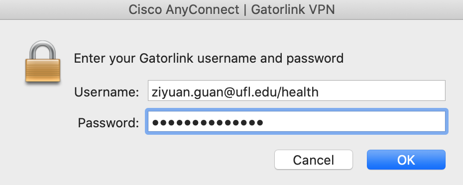

## VPN
Virtual Private Network is a protected network provided by University of Florida. 
Please read the [official documents](https://it.ufl.edu/ict/documentation/network-infrastructure/vpn/) to understand the VPN usage and download proper **AnyConnect Clients Software**.

### UF Health VPN

UF Health VPN is a closed network zone. All UF Health related devices, researchers and data are working within the network. 
Since our projects are involved with PHI data, we have to keep our job inside UF Health network.

Steps to connect with UF Health VPN:
1. Open `AnyConnect Client` software.
2. Fill `vpn.ufl.edu` as domain host path.
3. Click `Connect`:
    - username: Gatorlink\health
    - password: Gatorlink password

> Example: 
