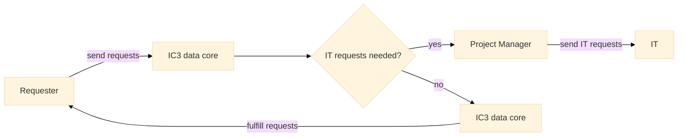

import Tabs from '@theme/Tabs';
import TabItem from '@theme/TabItem';
import CodeBlock from '@theme/CodeBlock';

:::warning
Any member who needs to access PHI/restricted data is mandatory to take IRB trainings and added into IRBs before obtaining any accesses.

To consult about IRB issues, please contact [Armfield, Brooke A](mailto:barmfield@ufl.edu) or [Davidson, Andrea](mailto:Andrea.Davidson@medicine.ufl.edu).
:::
## Resources

### Shared folder and Databases
Shared folder and databases are the infrastructures for storage. Both of them are managed by UF Health IT in **restricted UF Health network**. 
Shared folder is used to store datasets and in-house developed codes as flat files.  
Databases are used to store structed, cleaned data.

#### To obtain the access to shared folder/databases, here is the work flow:

1. PI needs to send requests to [IC3 Data Core](mailto:ziyuan.guan@ufl.edu) on behalf of the user.
2. [Wasykowski, Natalie](mailto:Natalie.Wasykowski@medicine.ufl.edu) is the project manager.
3. If the user has IRB issues, please contact [Armfield, Brooke A](mailto:barmfield@ufl.edu) or [Davidson, Andrea](mailto:Andrea.Davidson@medicine.ufl.edu).

 Mount the shared folder with local machine 

<Tabs
  defaultValue="Windows"
  values={[
    {label: 'Windows', value: 'Windows'},
    {label: 'MacOS/Linux', value: 'MacOS/Linux'},
  ]}>

  <TabItem value="Windows">
    1. Open file explorer and go to "My Computer."  
    2. Right click anywhere in the "My Computer" window and select "add network location" from the drop-down list.  
    3. A window will pop up asking you where you would like to create your network location. Select "Choose a custom location."  
    4. In the input box that comes up, type in <u>\\AHCDFS.AHC.ufl.edu\files\DOM\SHARE</u>  
         &nbsp;&nbsp;&nbsp;&nbsp;The login account is : UFAD\userName (eg. UFAD\ziyuan.guan) 
         &nbsp;&nbsp;&nbsp;&nbsp;The password is : gatorlink password  
    5. Name your new location "Share," and proceed to the final window. Click "Finish."  
  </TabItem>
  <TabItem value="MacOS/Linux">
    
Please follow this <a href='https://support.apple.com/guide/mac-help/set-up-file-sharing-on-mac-mh17131/mac'>link</a>

    1. Click File Manager  
    2. Click Connect-to-Server  
    3. The URL is: smb://AHCDFS.AHC.ufl.edu/files/DOM/SHARE.  
        &nbsp;&nbsp;&nbsp;&nbsp;The login account is : UFAD\userName (eg. UFAD\ziyuan.guan) 
        &nbsp;&nbsp;&nbsp;&nbsp;The password is : gatorlink password  
  </TabItem>
</Tabs>

#### To access the databases:
Please refer to [database access tutorial](/docs/tutorials/For%20Members/connectWithDatabase.mdx) to access the databases.

--- 

### IC3 GitHub

[IC3 GitHub](https://github.com/Prisma-pResearch) is private, please contact with [Guan, Ziyuan(Chester)](mailto:ziyuan.guan@ufl.edu) to obtain the access.

--- 

### IC3 Servers
To access servers, PI needs to send requests to [IC3 System Core](mailto:ziyuan.guan@ufl.edu) on behalf of the team member.  
:::tip
There are two ways to access the computational resources: 
:::
#### 1. Create `Jupyter Notebook Server` container for users
This method is suitable for **short-team** projects, OPS students and beginners. **It's the quickest way to get the computational resources currently.**
* **<u>Pros</u>**:
1. No need to send IT tickets to add user into the server.
2. It's easier to control the permissions of the user.
3. Our customized Jupyter notebook docker image has already installed packages for data processing and model training. 
* **<u>Cons</u>**:
1. Users only has the permissions for limited resources and files.
2. Users cannot use docker containers.

> IC3 System Core manages the `Jupyter Notebook Server` containers.

#### 2. Add user into server
This method is suitable for **long-term** projects, PHD students, data scientists and engineers.
* **<u>Pros</u>**:
1. Direct access to the server and docker container. 
2. Able to create personal environments.
* **<u>Cons</u>**:
1. Need to send IT tickets to add user into the server.
2. User needs to have fundamental knowledge to use Linux command lines.
3. User's casual operations might crash other people's work.

--- 

### HiPerGator
:::tip HiPerGator Groups
Currently, IC3 has **2** HiPerGator groups. 
:::

#### [`uf-iccc` group](/docs/workspaces/HiPerGator#uf-iccc-group)
The group aims to provide instant computational resources for educational purposes. 
To request the access to the group, please submit the request [here](https://gravity.rc.ufl.edu/access/request-account/)
> select Faculty Sponsor as `Guan, Ziyuan`

#### [`uf-chorus` group](/docs/workspaces/HiPerGator#uf-chorus-group)
The group aims to provide powerful computational resources for ChoRUS project. 
To request the access to the group, please submit the request [here](https://gravity.rc.ufl.edu/access/request-account/)
> select Faculty Sponsor as `Bihorac, Azra`

--- 

### UF Health VPN
UF Health IT manages the accounts who are able to use UF health VPN. 
Please contact with [IC3 System Core](mailto:ziyuan.guan@ufl.edu) to get the access.

:::info REMOVE ACCESS
Please remove the accesses asap when members left the projects.
:::

