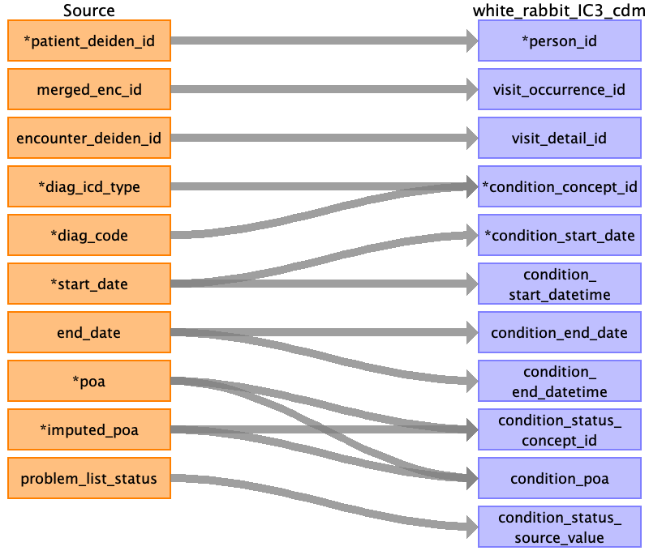

## Table name: condition_occurrence

### Reading from diagnoses_clean_0_0.csv

| Destination Field | Source field | Logic | Comment field |
| --- | --- | --- | --- |
| person_id | patient_deiden_id |  |  |
| visit_occurrence_id | merged_enc_id |  |  |
| visit_detail_id | encounter_deiden_id |  |  |
| condition_occurrence_id |  |  |  |
| condition_concept_id | diag_icd_type diag_code |  |  |
| condition_start_date | start_date |  |  |
| condition_start_datetime | start_date |  |  |
| condition_end_date | end_date |  |  |
| condition_end_datetime | end_date |  |  |
| condition_type_concept_id |  |  |  |
| condition_status_concept_id | poa imputed_poa |  |  |
| condition_poa | poa imputed_poa |  |  |
| condition_status_source_value | problem_list_status |  |  |
| provider_id |  |  | Not Populated |
| stop_reason |  |  | Not Populated |
| condition_source_value |  |  |  |
| condition_source_concept_id |  |  |  |

