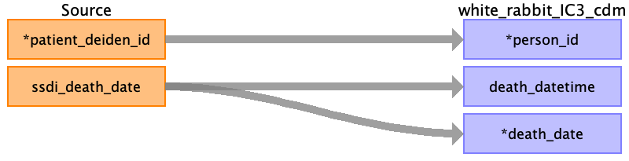
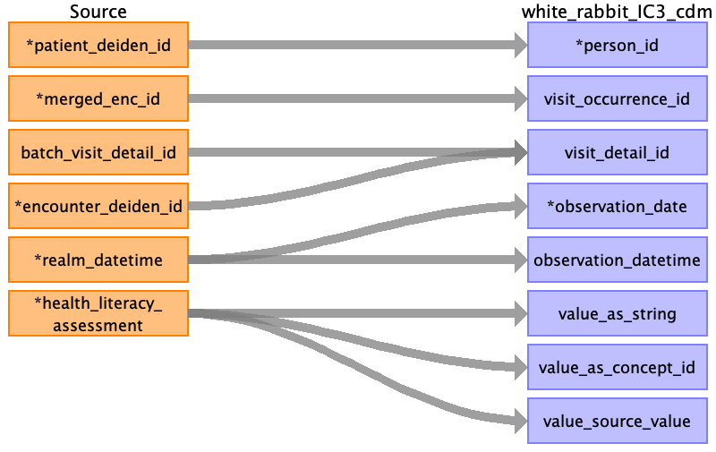

## Table name: death

### Reading from ssdi2_clean_0_0.csv

| Destination Field | Source field | Logic | Comment field |
| --- | --- | --- | --- |
| person_id | patient_deiden_id |  |  |
| death_id |  |  | Auto Increment |
| death_datetime | ssdi_death_date |  | Use ssdi_death_date to populate death_datetime and default the time to midnight. |
| death_date | ssdi_death_date |  | death_date is derived from ssdi_death_date. Please see the sheet map_table for additional mapping details. |
| death_type_concept_id |  |  | Fill with 32885 ( US Social Security Death Master File) for ssdi2 source else fill with (32817) for Encounters source |
| cause_concept_id |  |  | Not available |
| cause_source_value |  |  | Not available |
| cause_source_concept_id |  |  | Not available |

### Reading from encounters_clean_0_0.csv

| Destination Field | Source field | Logic | Comment field |
| --- | --- | --- | --- |
| person_id | patient_deiden_id |  |  |
| death_id |  |  | Auto Increment |
| death_datetime | death_date |  | Use death_date to populate death_datetime and default the time to midnight |
| death_date | death_date |  |  |
| death_type_concept_id |  |  | Fill with 32885 ( US Social Security Death Master File) for ssdi2 source else fill with (32817) for Encounters source |
| cause_concept_id |  |  | Not available |
| cause_source_value |  |  | Not available |
| cause_source_concept_id |  |  | Not available |

