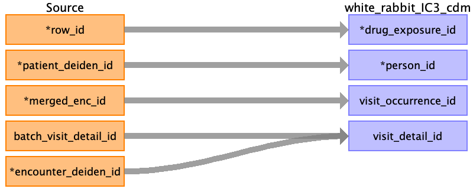

## Table name: drug_exposure

### Reading from meds_clean_0_0.csv

| Destination Field | Source field | Logic | Comment field |
| --- | --- | --- | --- |
| drug_exposure_id | row_id |  | Auto increment |
| person_id | patient_deiden_id |  |  |
| visit_occurrence_id | merged_enc_id |  |  |
| visit_detail_id | batch_visit_detail_id encounter_deiden_id |  |  |
| drug_concept_id |  |  |  |
| drug_exposure_start_date |  |  |  |
| drug_exposure_start_datetime |  |  |  |
| drug_exposure_end_date |  |  |  |
| drug_exposure_end_datetime |  |  |  |
| verbatim_end_date |  |  |  |
| drug_type_concept_id |  |  |  |
| stop_reason |  |  |  |
| refills |  |  |  |
| quantity |  |  |  |
| days_supply |  |  |  |
| sig |  |  |  |
| route_concept_id |  |  |  |
| lot_number |  |  |  |
| provider_id |  |  |  |
| drug_source_value |  |  |  |
| drug_source_concept_id |  |  |  |
| route_source_value |  |  |  |
| dose_source_value |  |  |  |
| dose_unit_source_value |  |  |  |
| non_standard_quantity |  |  |  |
| imputed_dose |  |  |  |
| order_number |  |  |  |

