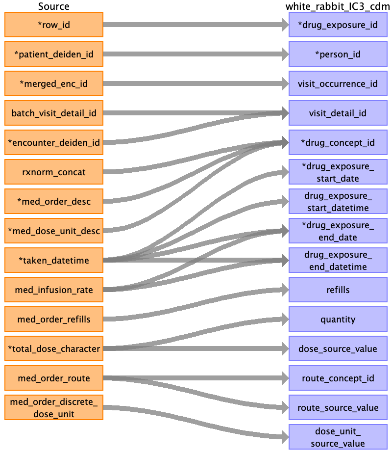

## Table name: drug_exposure

### Reading from meds_clean_0_0.csv

| Destination Field | Source field | Logic | Comment field |
| --- | --- | --- | --- |
| drug_exposure_id | row_id |  | Auto increment |
| person_id | patient_deiden_id |  |  |
| visit_occurrence_id | merged_enc_id |  |  |
| visit_detail_id | batch_visit_detail_idencounter_deiden_id |  |  |
| drug_concept_id | rxnorm_concatmed_order_descmed_dose_unit_desc |  | Manual curation(i.e; merge of these columns which will result in unique key ) |
| drug_exposure_start_date | taken_datetime |  |  |
| drug_exposure_start_datetime | taken_datetime |  |  |
| drug_exposure_end_date | taken_datetimemed_infusion_rate |  | Concat Taken_datetime with infusion duration |
| drug_exposure_end_datetime | taken_datetimemed_infusion_rate |  |  |
| refills | med_order_refills |  |  |
| quantity | total_dose_character |  |  |
| dose_source_value | total_dose_character |  |  |
| route_concept_id | med_order_route |  |  |
| route_source_value | med_order_route |  |  |
| dose_unit_source_value | med_order_discrete_dose_unit |  |  |
| verbatim_end_date |  |  | Not populated |
| drug_type_concept_id |  |  | Fill with 32817(EHR) |
| stop_reason |  |  | Not Available |
| days_supply |  |  | Not populated |
| sig |  |  | In the data coming up, sig might have a different name but it is mapped to sig source column if available |
| lot_number |  |  | Not Populated |
| provider_id |  |  | Not Populated |
| drug_source_value |  |  |  |
| drug_source_concept_id |  |  | Not Populated |
| non_standard_quantity |  |  | It is a binary flag for drugs that do not have standard quantity |
| imputed_dose |  |  | It is a binary flag to indicate that was inferred from the border description or not |
| order_number |  |  | med_order_deiden_id |

