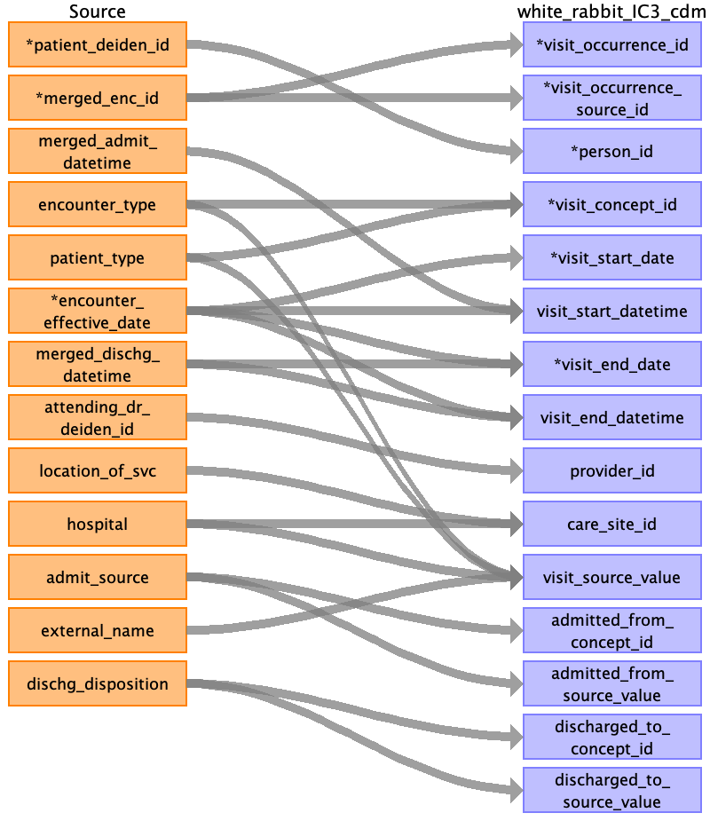

## Table name: location_history

### Reading from encounters_clean_0_0.csv

| Destination Field | Source field | Logic | Comment field |
| --- | --- | --- | --- |
| entity_id | patient_deiden_id |  |  |
| location_history_id |  |  | Auto increment |
| entity_domain |  |  | Fill with 1147314 Value (this value is linked to Person) |
| location_id |  |  | Derived in location table |
| start_date | encounter_effective_date |  |  |
| end_date | encounter_effective_date |  |  |
| location_type |  |  | Fill with Home |
| location_type_concept_id |  |  | Fill with 4139502(this value is for Home) |
| current_location |  |  | Binary flag for most up-to-date location for person in the database |

