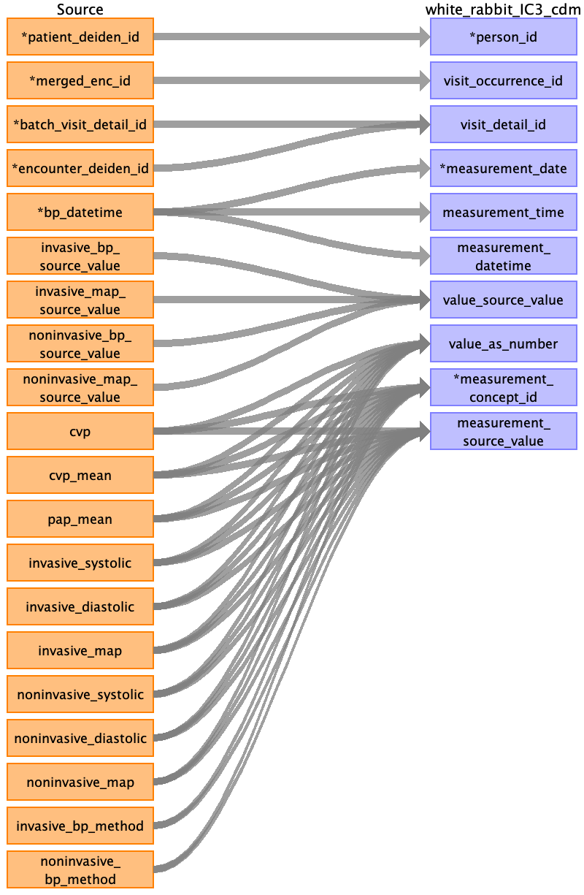
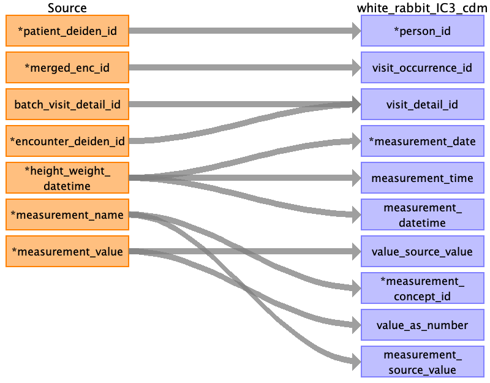
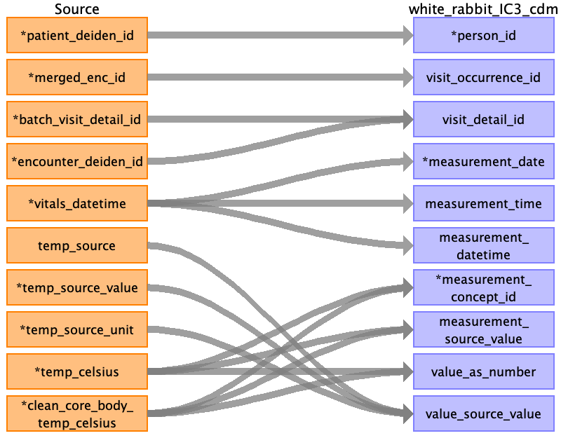
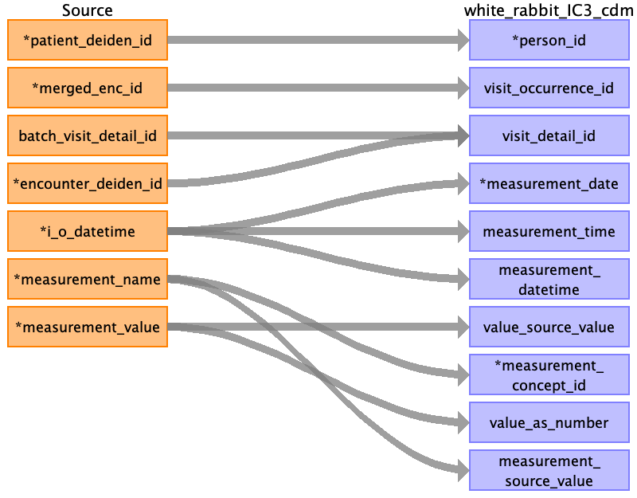
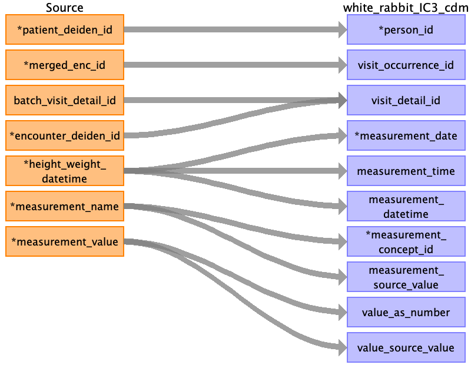
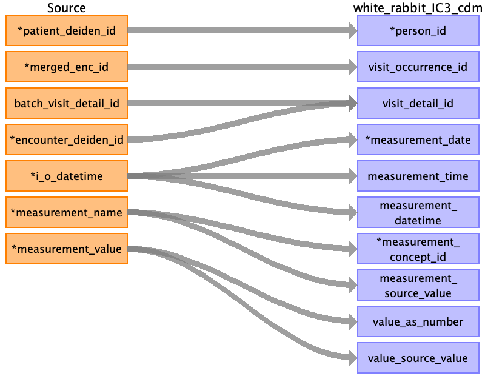

## Table name: measurement

### Reading from blood_pressure_clean_0_0.csv

| Destination Field | Source field | Logic | Comment field |
| --- | --- | --- | --- |
| person_id | patient_deiden_id |  | Person ID is the source ID from IDR after the project name and deidentification database intialization date.  |
| visit_occurrence_id | merged_enc_id |  |  |
| visit_detail_id | batch_visit_detail_id encounter_deiden_id |  | Looked up via batch visit detail id if avaialble, else lookup using encounter deiden id, else NULL |
| measurement_date | bp_datetime |  |  |
| measurement_time | bp_datetime |  |  |
| measurement_datetime | bp_datetime |  |  |
| measurement_concept_id | cvp cvp_mean pap_mean invasive_systolic invasive_diastolic invasive_map noninvasive_systolic noninvasive_diastolic noninvasive_map invasive_bp_method noninvasive_bp_method |  | Name of the field is used to populate the field Name of the field is used to populate the field Name of the field is used to populate the field Name of the field is used to populate the field Name of the field is used to populate the field Name of the field is used to populate the field Name of the field is used to populate the field Name of the field is used to populate the field Name of the field is used to populate the field Name of the field is used to populate the field Name of the field is used to populate the field Combination of method and column name (e.g. BP Cuff Systolic) then mapped using excel lookup table |
| measurement_source_value | cvp cvp_mean pap_mean invasive_bp_method noninvasive_bp_method invasive_systolic invasive_diastolic invasive_map noninvasive_systolic noninvasive_diastolic noninvasive_map |  | Name of the field is used to populate the field Name of the field is used to populate the field Name of the field is used to populate the field Name of the field is used to populate the field Name of the field is used to populate the field Name of the field is used to populate the field Name of the field is used to populate the field Name of the field is used to populate the field Name of the field is used to populate the field Name of the field is used to populate the field Name of the field is used to populate the field Combination of method and column name (e.g. BP Cuff Systolic) |
| value_as_number | cvp cvp_mean pap_mean invasive_systolic invasive_diastolic invasive_map noninvasive_systolic noninvasive_diastolic noninvasive_map |  | Value of the field is used to populate the field Value of the field is used to populate the field Value of the field is used to populate the field Value of the field is used to populate the field Value of the field is used to populate the field Value of the field is used to populate the field Value of the field is used to populate the field Value of the field is used to populate the field Value of the field is used to populate the field  |
| value_source_value | noninvasive_map_source_value noninvasive_bp_source_value invasive_bp_source_value invasive_map_source_value |  | Value of the field is used to populate the field Value of the field is used to populate the field Value of the field is used to populate the field Value of the field is used to populate the field  |
| measurement_id |  |  | AUTO INCREMENT |
| order_number |  |  | Not Populated |
| measurement_type_concept_id |  |  | Filled in as EHR (32817) |
| unit_concept_id |  |  | Filled in as concept id for mmHG if not in excel lookup table |
| unit_source_value |  |  | mmHG |
| value_as_concept_id |  |  | NOT POPULATED |
| operator_concept_id |  |  | NOT POPULATED |
| range_low |  |  | Not Populated |
| range_high |  |  | Not Populated |
| provider_id |  |  | Not populated |
| measurement_source_concept_id |  |  | Not Populated |
| unit_source_concept_id |  |  | Not Populated |
| measurement_event_id |  |  | Not Populated |
| meas_event_field_concept_id |  |  | Not Populated |

### Reading from sofa_clean_0_0.csv

| Destination Field | Source field | Logic | Comment field |
| --- | --- | --- | --- |
| person_id | patient_deiden_id |  |  |
| visit_occurrence_id | merged_enc_id |  |  |
| visit_detail_id | batch_visit_detail_id encounter_deiden_id |  | Looked up via batch visit detail id if avaialble, else lookup using encounter deiden id, else NULL |
| measurement_date | date_of_care |  |  |
| measurement_time | date_of_care |  |  |
| measurement_datetime | date_of_care |  |  |
| measurement_concept_id | respiration cns cardiovascular liver coagulation renal sofa_score |  | Name of the field is used to populate the field Name of the field is used to populate the field Name of the field is used to populate the field Name of the field is used to populate the field Name of the field is used to populate the field Name of the field is used to populate the field Name of the field is used to populate the field Combination of method and column name (e.g. BP Cuff Systolic) then mapped using excel lookup table |
| measurement_source_value | respiration cns cardiovascular liver coagulation renal sofa_score |  | Name of the field is used to populate the field Name of the field is used to populate the field Name of the field is used to populate the field Name of the field is used to populate the field Name of the field is used to populate the field Name of the field is used to populate the field Name of the field is used to populate the field Combination of method and column name (e.g. BP Cuff Systolic) |
| value_as_number | respiration cns cardiovascular liver coagulation renal sofa_score |  | Value of the field is used to populate the field Value of the field is used to populate the field Value of the field is used to populate the field Value of the field is used to populate the field Value of the field is used to populate the field Value of the field is used to populate the field Value of the field is used to populate the field  |
| value_source_value |  |  |  |
| measurement_id |  |  | AUTO INCREMENT |
| order_number |  |  | Not Populated |
| measurement_type_concept_id |  |  | Filled in as EHR (32817) |
| unit_concept_id |  |  | Filled in as concept id for mmHG if not in excel lookup table |
| unit_source_value |  |  | mmHG |
| value_as_concept_id |  |  | NOT POPULATED |
| operator_concept_id |  |  | NOT POPULATED |
| range_low |  |  | Not Populated |
| range_high |  |  | Not Populated |
| provider_id |  |  | Not populated |
| measurement_source_concept_id |  |  | Not Populated |
| unit_source_concept_id |  |  | Not Populated |
| measurement_event_id |  |  | Not Populated |
| meas_event_field_concept_id |  |  | Not Populated |

### Reading from temperature_clean_0_0.csv

| Destination Field | Source field | Logic | Comment field |
| --- | --- | --- | --- |
| person_id | patient_deiden_id |  |  |
| visit_occurrence_id | merged_enc_id |  |  |
| visit_detail_id | batch_visit_detail_id encounter_deiden_id |  | Looked up via batch visit detail id if avaialble, else lookup using encounter deiden id, else NULL |
| measurement_date | vitals_datetime |  |  |
| measurement_time | vitals_datetime |  |  |
| measurement_datetime | vitals_datetime |  |  |
| measurement_concept_id | temp_celsius clean_core_body_temp_celsius |  | Name of the field is used to populate the field Name of the field is used to populate the field Combination of method and column name (e.g. BP Cuff Systolic) then mapped using excel lookup table |
| measurement_source_value | temp_celsius clean_core_body_temp_celsius |  | Name of the field is used to populate the field Name of the field is used to populate the field Combination of method and column name (e.g. BP Cuff Systolic) |
| value_as_number | temp_celsius clean_core_body_temp_celsius |  | Value of the field is used to populate the field Value of this field is used to populate the field  |
| value_source_value | temp_source_value temp_source temp_source_unit |  | Value of this field is used to populate the field Value of this field is used to populate the field Value of this field is used to populate the field  |
| measurement_id |  |  | AUTO INCREMENT |
| order_number |  |  | Not Populated |
| measurement_type_concept_id |  |  | Filled in as EHR (32817) |
| unit_concept_id |  |  | Filled in as concept id for mmHG if not in excel lookup table |
| unit_source_value |  |  | mmHG |
| value_as_concept_id |  |  | NOT POPULATED |
| operator_concept_id |  |  | NOT POPULATED |
| range_low |  |  | Not Populated |
| range_high |  |  | Not Populated |
| provider_id |  |  | Not populated |
| measurement_source_concept_id |  |  | Not Populated |
| unit_source_concept_id |  |  | Not Populated |
| measurement_event_id |  |  | Not Populated |
| meas_event_field_concept_id |  |  | Not Populated |

### Reading from anesthesia_clean_0_0.csv

| Destination Field | Source field | Logic | Comment field |
| --- | --- | --- | --- |
| person_id | patient_deiden_id |  |  |
| visit_occurrence_id | merged_enc_id |  |  |
| visit_detail_id | batch_visit_detail_id encounter_deiden_id |  | Looked up via batch visit detail id if avaialble, else lookup using encounter deiden id, else NULL |
| measurement_date | anesthesia_datetime |  |  |
| measurement_time | anesthesia_datetime |  |  |
| measurement_datetime | anesthesia_datetime |  |  |
| measurement_concept_id | bis_index |  | Name of this field is used to populate the field Combination of method and column name (e.g. BP Cuff Systolic) then mapped using excel lookup table |
| measurement_source_value | bis_index |  | Name of this field is used to populate the field Combination of method and column name (e.g. BP Cuff Systolic) |
| value_as_number | bis_index |  | Value of this field is used to populate the field  |
| value_source_value |  |  |  |
| measurement_id |  |  | AUTO INCREMENT |
| order_number |  |  | Not Populated |
| measurement_type_concept_id |  |  | Filled in as EHR (32817) |
| unit_concept_id |  |  | Filled in as concept id for mmHG if not in excel lookup table |
| unit_source_value |  |  | mmHG |
| value_as_concept_id |  |  | NOT POPULATED |
| operator_concept_id |  |  | NOT POPULATED |
| range_low |  |  | Not Populated |
| range_high |  |  | Not Populated |
| provider_id |  |  | Not populated |
| measurement_source_concept_id |  |  | Not Populated |
| unit_source_concept_id |  |  | Not Populated |
| measurement_event_id |  |  | Not Populated |
| meas_event_field_concept_id |  |  | Not Populated |

### Reading from heart_rate_clean_0_0.csv

| Destination Field | Source field | Logic | Comment field |
| --- | --- | --- | --- |
| person_id | patient_deiden_id |  |  |
| visit_occurrence_id | merged_enc_id |  |  |
| visit_detail_id | batch_visit_detail_id encounter_deiden_id |  | Looked up via batch visit detail id if avaialble, else lookup using encounter deiden id, else NULL |
| measurement_date | vitals_datetime |  |  |
| measurement_time | vitals_datetime |  |  |
| measurement_datetime | vitals_datetime |  |  |
| measurement_concept_id | heart_rate |  | Name of this field is used to populate the field Combination of method and column name (e.g. BP Cuff Systolic) then mapped using excel lookup table |
| measurement_source_value | heart_rate |  | Name of this field is used to populate the field Combination of method and column name (e.g. BP Cuff Systolic) |
| value_as_number | heart_rate |  | Value of this field is used to populate the field  |
| value_source_value | heart_rate_source |  | Value of this field is used to populate the field  |
| measurement_id |  |  | AUTO INCREMENT |
| order_number |  |  | Not Populated |
| measurement_type_concept_id |  |  | Filled in as EHR (32817) |
| unit_concept_id |  |  | Filled in as concept id for mmHG if not in excel lookup table |
| unit_source_value |  |  | mmHG |
| value_as_concept_id |  |  | NOT POPULATED |
| operator_concept_id |  |  | NOT POPULATED |
| range_low |  |  | Not Populated |
| range_high |  |  | Not Populated |
| provider_id |  |  | Not populated |
| measurement_source_concept_id |  |  | Not Populated |
| unit_source_concept_id |  |  | Not Populated |
| measurement_event_id |  |  | Not Populated |
| meas_event_field_concept_id |  |  | Not Populated |

### Reading from height_weight_clean_0_0.csv

| Destination Field | Source field | Logic | Comment field |
| --- | --- | --- | --- |
| person_id | patient_deiden_id |  |  |
| visit_occurrence_id | merged_enc_id |  |  |
| visit_detail_id | batch_visit_detail_id encounter_deiden_id |  | Looked up via batch visit detail id if avaialble, else lookup using encounter deiden id, else NULL |
| measurement_date | height_weight_datetime |  |  |
| measurement_time | height_weight_datetime |  |  |
| measurement_datetime | height_weight_datetime |  |  |
| measurement_concept_id | measurement_name |  | If it is empty, fill with 0 as default value. Else, Name of this field is used to populate the field Combination of method and column name (e.g. BP Cuff Systolic) then mapped using excel lookup table |
| measurement_source_value | measurement_name |  | Name of this field is used to populate the field Combination of method and column name (e.g. BP Cuff Systolic) |
| value_as_number | measurement_value |  | Value of this field is used to populate the field  |
| value_source_value | measurement_value |  | Value of this field is used to populate the field  |
| measurement_id |  |  | AUTO INCREMENT |
| order_number |  |  | Not Populated |
| measurement_type_concept_id |  |  | Filled in as EHR (32817) |
| unit_concept_id |  |  | Filled in as concept id for mmHG if not in excel lookup table |
| unit_source_value |  |  | mmHG |
| value_as_concept_id |  |  | NOT POPULATED |
| operator_concept_id |  |  | NOT POPULATED |
| range_low |  |  | Not Populated |
| range_high |  |  | Not Populated |
| provider_id |  |  | Not populated |
| measurement_source_concept_id |  |  | Not Populated |
| unit_source_concept_id |  |  | Not Populated |
| measurement_event_id |  |  | Not Populated |
| meas_event_field_concept_id |  |  | Not Populated |

### Reading from mac_components_clean_0_0.csv

| Destination Field | Source field | Logic | Comment field |
| --- | --- | --- | --- |
| person_id | patient_deiden_id |  |  |
| visit_occurrence_id | merged_enc_id |  |  |
| visit_detail_id | batch_visit_detail_id encounter_deiden_id |  | Looked up via batch visit detail id if avaialble, else lookup using encounter deiden id, else NULL |
| measurement_date | recorded_time |  |  |
| measurement_time | recorded_time |  |  |
| measurement_datetime | recorded_time |  |  |
| measurement_concept_id | disp_name |  | Name of this field is used to populate the field Combination of method and column name (e.g. BP Cuff Systolic) then mapped using excel lookup table |
| measurement_source_value | disp_name |  | Name of this field is used to populate the field Combination of method and column name (e.g. BP Cuff Systolic) |
| value_as_number | meas_value |  | Value of this field is used to populate the field  |
| value_source_value | meas_value |  | Value of this field is used to populate the field  |
| measurement_id |  |  | AUTO INCREMENT |
| order_number |  |  | Not Populated |
| measurement_type_concept_id |  |  | Filled in as EHR (32817) |
| unit_concept_id |  |  | Filled in as concept id for mmHG if not in excel lookup table |
| unit_source_value |  |  | mmHG |
| value_as_concept_id |  |  | NOT POPULATED |
| operator_concept_id |  |  | NOT POPULATED |
| range_low |  |  | Not Populated |
| range_high |  |  | Not Populated |
| provider_id |  |  | Not populated |
| measurement_source_concept_id |  |  | Not Populated |
| unit_source_concept_id |  |  | Not Populated |
| measurement_event_id |  |  | Not Populated |
| meas_event_field_concept_id |  |  | Not Populated |

### Reading from 60_ecg_cardiology_detail_clean_0_0.csv

| Destination Field | Source field | Logic | Comment field |
| --- | --- | --- | --- |
| person_id | patient_deiden_id |  |  |
| visit_occurrence_id | merged_enc_id |  |  |
| visit_detail_id | batch_visit_detail_id encounter_deiden_id |  | Looked up via batch visit detail id if avaialble, else lookup using encounter deiden id, else NULL |
| measurement_date | ecg_acq_date |  |  |
| measurement_time | ecg_acq_time |  |  |
| measurement_datetime | ecg_acq_date ecg_acq_time |  |  |
| measurement_concept_id |  |  | Combination of method and column name (e.g. BP Cuff Systolic) then mapped using excel lookup table |
| measurement_source_value |  |  | Combination of method and column name (e.g. BP Cuff Systolic) |
| value_as_number |  |  |  |
| value_source_value |  |  |  |
| measurement_id |  |  | AUTO INCREMENT |
| order_number |  |  | Not Populated |
| measurement_type_concept_id |  |  | Filled in as EHR (32817) |
| unit_concept_id |  |  | Filled in as concept id for mmHG if not in excel lookup table |
| unit_source_value |  |  | mmHG |
| value_as_concept_id |  |  | NOT POPULATED |
| operator_concept_id |  |  | NOT POPULATED |
| range_low |  |  | Not Populated |
| range_high |  |  | Not Populated |
| provider_id |  |  | Not populated |
| measurement_source_concept_id |  |  | Not Populated |
| unit_source_concept_id |  |  | Not Populated |
| measurement_event_id |  |  | Not Populated |
| meas_event_field_concept_id |  |  | Not Populated |

### Reading from intake_outtake_clean_0_0.csv

| Destination Field | Source field | Logic | Comment field |
| --- | --- | --- | --- |
| person_id | patient_deiden_id |  |  |
| visit_occurrence_id | merged_enc_id |  |  |
| visit_detail_id | batch_visit_detail_id encounter_deiden_id |  | Looked up via batch visit detail id if avaialble, else lookup using encounter deiden id, else NULL |
| measurement_date | i_o_datetime |  |  |
| measurement_time | i_o_datetime |  |  |
| measurement_datetime | i_o_datetime |  |  |
| measurement_concept_id | measurement_name |  | Name of this field is used to populate the field Combination of method and column name (e.g. BP Cuff Systolic) then mapped using excel lookup table |
| measurement_source_value | measurement_name |  | Name of this field is used to populate the field Combination of method and column name (e.g. BP Cuff Systolic) |
| value_as_number | measurement_value |  | Value of this field is used to populate the field  |
| value_source_value | measurement_value |  | Value of this field is used to populate the field  |
| measurement_id |  |  | AUTO INCREMENT |
| order_number |  |  | Not Populated |
| measurement_type_concept_id |  |  | Filled in as EHR (32817) |
| unit_concept_id |  |  | Filled in as concept id for mmHG if not in excel lookup table |
| unit_source_value |  |  | mmHG |
| value_as_concept_id |  |  | NOT POPULATED |
| operator_concept_id |  |  | NOT POPULATED |
| range_low |  |  | Not Populated |
| range_high |  |  | Not Populated |
| provider_id |  |  | Not populated |
| measurement_source_concept_id |  |  | Not Populated |
| unit_source_concept_id |  |  | Not Populated |
| measurement_event_id |  |  | Not Populated |
| meas_event_field_concept_id |  |  | Not Populated |

### Reading from q1_sofa_clean_0_0.csv

| Destination Field | Source field | Logic | Comment field |
| --- | --- | --- | --- |
| person_id |  |  |  |
| visit_occurrence_id |  |  |  |
| visit_detail_id |  |  | Looked up via batch visit detail id if avaialble, else lookup using encounter deiden id, else NULL |
| measurement_date |  |  |  |
| measurement_time |  |  |  |
| measurement_datetime |  |  |  |
| measurement_concept_id |  |  | Combination of method and column name (e.g. BP Cuff Systolic) then mapped using excel lookup table |
| measurement_source_value |  |  | Combination of method and column name (e.g. BP Cuff Systolic) |
| value_as_number |  |  |  |
| value_source_value |  |  |  |
| measurement_id |  |  | AUTO INCREMENT |
| order_number |  |  | Not Populated |
| measurement_type_concept_id |  |  | Filled in as EHR (32817) |
| unit_concept_id |  |  | Filled in as concept id for mmHG if not in excel lookup table |
| unit_source_value |  |  | mmHG |
| value_as_concept_id |  |  | NOT POPULATED |
| operator_concept_id |  |  | NOT POPULATED |
| range_low |  |  | Not Populated |
| range_high |  |  | Not Populated |
| provider_id |  |  | Not populated |
| measurement_source_concept_id |  |  | Not Populated |
| unit_source_concept_id |  |  | Not Populated |
| measurement_event_id |  |  | Not Populated |
| meas_event_field_concept_id |  |  | Not Populated |

