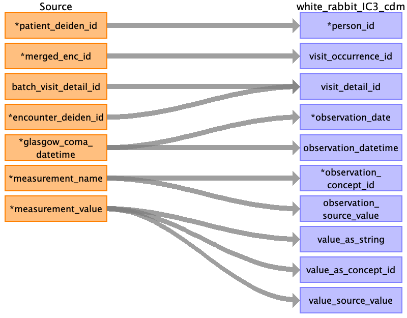
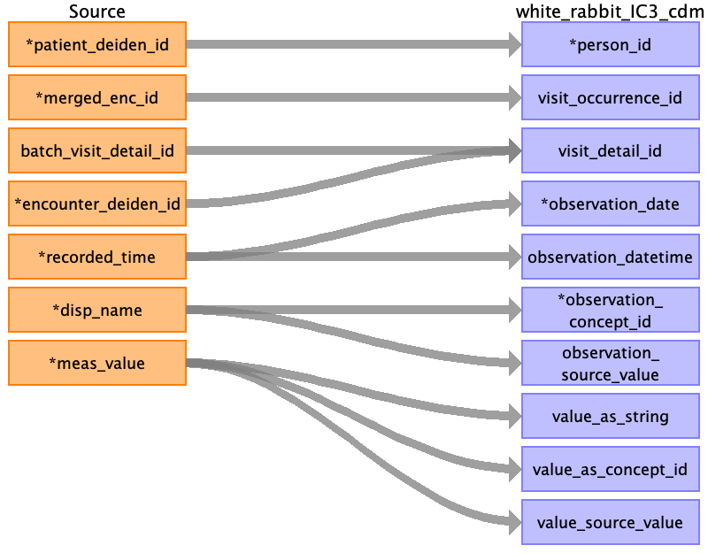
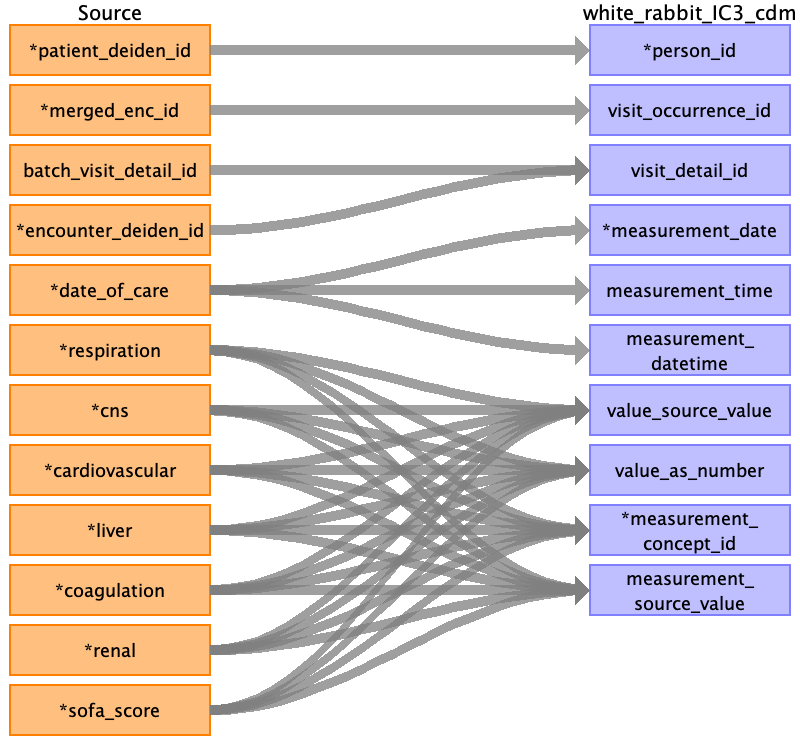
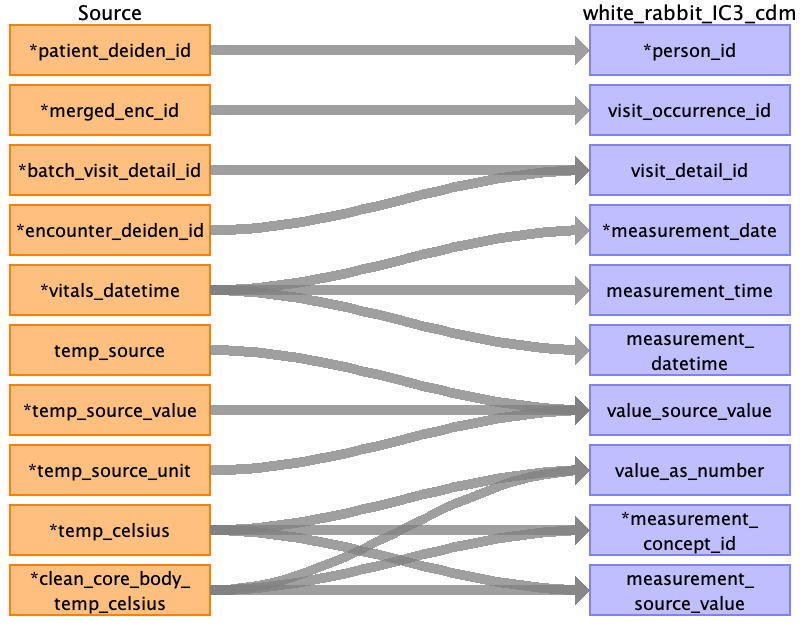
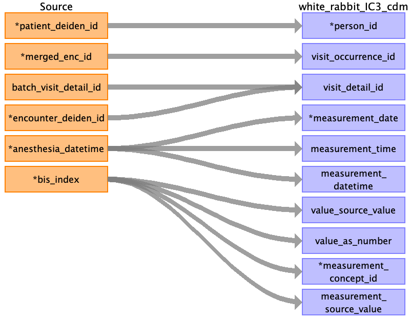

## Table name: measurement

### Reading from blood_pressure_clean_0_0.csv

| Destination Field | Source field | Logic | Comment field |
| --- | --- | --- | --- |
| person_id | patient_deiden_id |  | Person ID is the source ID from IDR after the project name and deidentification database intialization date.  |
| visit_occurrence_id | merged_enc_id |  |  |
| visit_detail_id | batch_visit_detail_id encounter_deiden_id |  | Looked up via batch visit detail id if avaialble, else lookup using encounter deiden id, else NULL |
| measurement_date | bp_datetime |  |  |
| measurement_time | bp_datetime |  |  |
| measurement_datetime | bp_datetime |  |  |
| value_source_value | noninvasive_map_source_value noninvasive_bp_source_value invasive_bp_source_value invasive_map_source_value |  |  |
| measurement_concept_id | cvp cvp_mean pap_mean invasive_systolic invasive_diastolic invasive_map noninvasive_systolic noninvasive_diastolic noninvasive_map invasive_bp_method noninvasive_bp_method |  | Combination of method and column name (e.g. BP Cuff Systolic) then mapped using excel lookup table |
| value_as_number | cvp cvp_mean pap_mean invasive_systolic invasive_diastolic invasive_map noninvasive_systolic noninvasive_diastolic noninvasive_map |  |  |
| measurement_source_value | cvp cvp_mean pap_mean invasive_bp_method noninvasive_bp_method invasive_systolic invasive_diastolic invasive_map noninvasive_systolic noninvasive_diastolic noninvasive_map |  | Combination of method and column name (e.g. BP Cuff Systolic) |
| measurement_id |  |  | AUTO INCREMENT |
| order_number |  |  | order_num_deiden_id (multimodal AI only, all others is not populated) |
| measurement_type_concept_id |  |  | Filled in as EHR (32817) |
| unit_concept_id |  |  | Filled in as concept id for mmHG if not in excel lookup table |
| unit_source_value |  |  | mmHG |
| value_as_concept_id |  |  | NOT POPULATED |
| operator_concept_id |  |  | NOT POPULATED |
| range_low |  |  | Not Populated |
| range_high |  |  | Not Populated |
| provider_id |  |  | Not populated |
| measurement_source_concept_id |  |  | Not Populated |
| unit_source_concept_id |  |  | Not Populated |
| measurement_event_id |  |  | Not Populated |
| meas_event_field_concept_id |  |  | Not Populated |

### Reading from sofa_clean_0_0.csv

| Destination Field | Source field | Logic | Comment field |
| --- | --- | --- | --- |
| person_id | patient_deiden_id |  |  |
| visit_occurrence_id | merged_enc_id |  |  |
| visit_detail_id | batch_visit_detail_id encounter_deiden_id |  | Looked up via batch visit detail id if avaialble, else lookup using encounter deiden id, else NULL |
| measurement_date | date_of_care |  |  |
| measurement_time | date_of_care |  |  |
| measurement_datetime | date_of_care |  |  |
| value_source_value |  |  |  |
| measurement_concept_id | respiration cns cardiovascular liver coagulation renal sofa_score |  | Combination of method and column name (e.g. BP Cuff Systolic) then mapped using excel lookup table |
| value_as_number | respiration cns cardiovascular liver coagulation renal sofa_score |  |  |
| measurement_source_value | respiration cns cardiovascular liver coagulation renal sofa_score |  | Combination of method and column name (e.g. BP Cuff Systolic) |
| measurement_id |  |  | AUTO INCREMENT |
| order_number |  |  | order_num_deiden_id (multimodal AI only, all others is not populated) |
| measurement_type_concept_id |  |  | Filled in as EHR (32817) |
| unit_concept_id |  |  | Filled in as concept id for mmHG if not in excel lookup table |
| unit_source_value |  |  | mmHG |
| value_as_concept_id |  |  | NOT POPULATED |
| operator_concept_id |  |  | NOT POPULATED |
| range_low |  |  | Not Populated |
| range_high |  |  | Not Populated |
| provider_id |  |  | Not populated |
| measurement_source_concept_id |  |  | Not Populated |
| unit_source_concept_id |  |  | Not Populated |
| measurement_event_id |  |  | Not Populated |
| meas_event_field_concept_id |  |  | Not Populated |

### Reading from temperature_clean_0_0.csv

| Destination Field | Source field | Logic | Comment field |
| --- | --- | --- | --- |
| person_id | patient_deiden_id |  |  |
| visit_occurrence_id | merged_enc_id |  |  |
| visit_detail_id | batch_visit_detail_id encounter_deiden_id |  | Looked up via batch visit detail id if avaialble, else lookup using encounter deiden id, else NULL |
| measurement_date | vitals_datetime |  |  |
| measurement_time | vitals_datetime |  |  |
| measurement_datetime | vitals_datetime |  |  |
| value_source_value | temp_source_value temp_source temp_source_unit |  |  |
| measurement_concept_id | temp_celsius clean_core_body_temp_celsius |  | Combination of method and column name (e.g. BP Cuff Systolic) then mapped using excel lookup table |
| value_as_number | temp_celsius clean_core_body_temp_celsius |  |  |
| measurement_source_value | temp_celsius clean_core_body_temp_celsius |  | Combination of method and column name (e.g. BP Cuff Systolic) |
| measurement_id |  |  | AUTO INCREMENT |
| order_number |  |  | order_num_deiden_id (multimodal AI only, all others is not populated) |
| measurement_type_concept_id |  |  | Filled in as EHR (32817) |
| unit_concept_id |  |  | Filled in as concept id for mmHG if not in excel lookup table |
| unit_source_value |  |  | mmHG |
| value_as_concept_id |  |  | NOT POPULATED |
| operator_concept_id |  |  | NOT POPULATED |
| range_low |  |  | Not Populated |
| range_high |  |  | Not Populated |
| provider_id |  |  | Not populated |
| measurement_source_concept_id |  |  | Not Populated |
| unit_source_concept_id |  |  | Not Populated |
| measurement_event_id |  |  | Not Populated |
| meas_event_field_concept_id |  |  | Not Populated |

### Reading from anesthesia_clean_0_0.csv

| Destination Field | Source field | Logic | Comment field |
| --- | --- | --- | --- |
| person_id | patient_deiden_id |  |  |
| visit_occurrence_id | merged_enc_id |  |  |
| visit_detail_id | batch_visit_detail_id encounter_deiden_id |  | Looked up via batch visit detail id if avaialble, else lookup using encounter deiden id, else NULL |
| measurement_date | anesthesia_datetime |  |  |
| measurement_time | anesthesia_datetime |  |  |
| measurement_datetime | anesthesia_datetime |  |  |
| value_source_value |  |  |  |
| measurement_concept_id | bis_index |  | Combination of method and column name (e.g. BP Cuff Systolic) then mapped using excel lookup table |
| value_as_number | bis_index |  |  |
| measurement_source_value | bis_index |  | Combination of method and column name (e.g. BP Cuff Systolic) |
| measurement_id |  |  | AUTO INCREMENT |
| order_number |  |  | order_num_deiden_id (multimodal AI only, all others is not populated) |
| measurement_type_concept_id |  |  | Filled in as EHR (32817) |
| unit_concept_id |  |  | Filled in as concept id for mmHG if not in excel lookup table |
| unit_source_value |  |  | mmHG |
| value_as_concept_id |  |  | NOT POPULATED |
| operator_concept_id |  |  | NOT POPULATED |
| range_low |  |  | Not Populated |
| range_high |  |  | Not Populated |
| provider_id |  |  | Not populated |
| measurement_source_concept_id |  |  | Not Populated |
| unit_source_concept_id |  |  | Not Populated |
| measurement_event_id |  |  | Not Populated |
| meas_event_field_concept_id |  |  | Not Populated |

### Reading from heart_rate_clean_0_0.csv

| Destination Field | Source field | Logic | Comment field |
| --- | --- | --- | --- |
| person_id | patient_deiden_id |  |  |
| visit_occurrence_id | merged_enc_id |  |  |
| visit_detail_id | batch_visit_detail_id encounter_deiden_id |  | Looked up via batch visit detail id if avaialble, else lookup using encounter deiden id, else NULL |
| measurement_date | vitals_datetime |  |  |
| measurement_time | vitals_datetime |  |  |
| measurement_datetime | vitals_datetime |  |  |
| value_source_value | heart_rate_source |  |  |
| measurement_concept_id | heart_rate |  | Combination of method and column name (e.g. BP Cuff Systolic) then mapped using excel lookup table |
| value_as_number | heart_rate |  |  |
| measurement_source_value | heart_rate |  | Combination of method and column name (e.g. BP Cuff Systolic) |
| measurement_id |  |  | AUTO INCREMENT |
| order_number |  |  | order_num_deiden_id (multimodal AI only, all others is not populated) |
| measurement_type_concept_id |  |  | Filled in as EHR (32817) |
| unit_concept_id |  |  | Filled in as concept id for mmHG if not in excel lookup table |
| unit_source_value |  |  | mmHG |
| value_as_concept_id |  |  | NOT POPULATED |
| operator_concept_id |  |  | NOT POPULATED |
| range_low |  |  | Not Populated |
| range_high |  |  | Not Populated |
| provider_id |  |  | Not populated |
| measurement_source_concept_id |  |  | Not Populated |
| unit_source_concept_id |  |  | Not Populated |
| measurement_event_id |  |  | Not Populated |
| meas_event_field_concept_id |  |  | Not Populated |

### Reading from height_weight_clean_0_0.csv

| Destination Field | Source field | Logic | Comment field |
| --- | --- | --- | --- |
| person_id | patient_deiden_id |  |  |
| visit_occurrence_id | merged_enc_id |  |  |
| visit_detail_id | batch_visit_detail_id encounter_deiden_id |  | Looked up via batch visit detail id if avaialble, else lookup using encounter deiden id, else NULL |
| measurement_date | height_weight_datetime |  |  |
| measurement_time | height_weight_datetime |  |  |
| measurement_datetime | height_weight_datetime |  |  |
| value_source_value | measurement_value |  |  |
| measurement_concept_id | measurement_name |  | If it is empty, fill with 0 as default value Combination of method and column name (e.g. BP Cuff Systolic) then mapped using excel lookup table |
| value_as_number | measurement_value |  |  |
| measurement_source_value | measurement_name |  | Combination of method and column name (e.g. BP Cuff Systolic) |
| measurement_id |  |  | AUTO INCREMENT |
| order_number |  |  | order_num_deiden_id (multimodal AI only, all others is not populated) |
| measurement_type_concept_id |  |  | Filled in as EHR (32817) |
| unit_concept_id |  |  | Filled in as concept id for mmHG if not in excel lookup table |
| unit_source_value |  |  | mmHG |
| value_as_concept_id |  |  | NOT POPULATED |
| operator_concept_id |  |  | NOT POPULATED |
| range_low |  |  | Not Populated |
| range_high |  |  | Not Populated |
| provider_id |  |  | Not populated |
| measurement_source_concept_id |  |  | Not Populated |
| unit_source_concept_id |  |  | Not Populated |
| measurement_event_id |  |  | Not Populated |
| meas_event_field_concept_id |  |  | Not Populated |

### Reading from mac_components_clean_0_0.csv

| Destination Field | Source field | Logic | Comment field |
| --- | --- | --- | --- |
| person_id | patient_deiden_id |  |  |
| visit_occurrence_id | merged_enc_id |  |  |
| visit_detail_id | batch_visit_detail_id encounter_deiden_id |  | Looked up via batch visit detail id if avaialble, else lookup using encounter deiden id, else NULL |
| measurement_date | recorded_time |  |  |
| measurement_time | recorded_time |  |  |
| measurement_datetime | recorded_time |  |  |
| value_source_value | meas_value |  |  |
| measurement_concept_id | disp_name |  | Combination of method and column name (e.g. BP Cuff Systolic) then mapped using excel lookup table |
| value_as_number | meas_value |  |  |
| measurement_source_value | disp_name |  | Combination of method and column name (e.g. BP Cuff Systolic) |
| measurement_id |  |  | AUTO INCREMENT |
| order_number |  |  | order_num_deiden_id (multimodal AI only, all others is not populated) |
| measurement_type_concept_id |  |  | Filled in as EHR (32817) |
| unit_concept_id |  |  | Filled in as concept id for mmHG if not in excel lookup table |
| unit_source_value |  |  | mmHG |
| value_as_concept_id |  |  | NOT POPULATED |
| operator_concept_id |  |  | NOT POPULATED |
| range_low |  |  | Not Populated |
| range_high |  |  | Not Populated |
| provider_id |  |  | Not populated |
| measurement_source_concept_id |  |  | Not Populated |
| unit_source_concept_id |  |  | Not Populated |
| measurement_event_id |  |  | Not Populated |
| meas_event_field_concept_id |  |  | Not Populated |

### Reading from 60_ecg_cardiology_detail_clean_0_0.csv

| Destination Field | Source field | Logic | Comment field |
| --- | --- | --- | --- |
| person_id | patient_deiden_id |  |  |
| visit_occurrence_id | merged_enc_id |  |  |
| visit_detail_id | batch_visit_detail_id encounter_deiden_id |  | Looked up via batch visit detail id if avaialble, else lookup using encounter deiden id, else NULL |
| measurement_date | ecg_acq_date |  |  |
| measurement_time | ecg_acq_time |  |  |
| measurement_datetime | ecg_acq_date ecg_acq_time |  |  |
| value_source_value |  |  |  |
| measurement_concept_id |  |  | Combination of method and column name (e.g. BP Cuff Systolic) then mapped using excel lookup table |
| value_as_number |  |  |  |
| measurement_source_value |  |  | Combination of method and column name (e.g. BP Cuff Systolic) |
| measurement_id |  |  | AUTO INCREMENT |
| order_number |  |  | order_num_deiden_id (multimodal AI only, all others is not populated) |
| measurement_type_concept_id |  |  | Filled in as EHR (32817) |
| unit_concept_id |  |  | Filled in as concept id for mmHG if not in excel lookup table |
| unit_source_value |  |  | mmHG |
| value_as_concept_id |  |  | NOT POPULATED |
| operator_concept_id |  |  | NOT POPULATED |
| range_low |  |  | Not Populated |
| range_high |  |  | Not Populated |
| provider_id |  |  | Not populated |
| measurement_source_concept_id |  |  | Not Populated |
| unit_source_concept_id |  |  | Not Populated |
| measurement_event_id |  |  | Not Populated |
| meas_event_field_concept_id |  |  | Not Populated |

### Reading from intake_outtake_clean_0_0.csv

| Destination Field | Source field | Logic | Comment field |
| --- | --- | --- | --- |
| person_id | patient_deiden_id |  |  |
| visit_occurrence_id | merged_enc_id |  |  |
| visit_detail_id | batch_visit_detail_id encounter_deiden_id |  | Looked up via batch visit detail id if avaialble, else lookup using encounter deiden id, else NULL |
| measurement_date | i_o_datetime |  |  |
| measurement_time | i_o_datetime |  |  |
| measurement_datetime | i_o_datetime |  |  |
| value_source_value | measurement_value |  |  |
| measurement_concept_id | measurement_name |  | Combination of method and column name (e.g. BP Cuff Systolic) then mapped using excel lookup table |
| value_as_number | measurement_value |  |  |
| measurement_source_value | measurement_name |  | Combination of method and column name (e.g. BP Cuff Systolic) |
| measurement_id |  |  | AUTO INCREMENT |
| order_number |  |  | order_num_deiden_id (multimodal AI only, all others is not populated) |
| measurement_type_concept_id |  |  | Filled in as EHR (32817) |
| unit_concept_id |  |  | Filled in as concept id for mmHG if not in excel lookup table |
| unit_source_value |  |  | mmHG |
| value_as_concept_id |  |  | NOT POPULATED |
| operator_concept_id |  |  | NOT POPULATED |
| range_low |  |  | Not Populated |
| range_high |  |  | Not Populated |
| provider_id |  |  | Not populated |
| measurement_source_concept_id |  |  | Not Populated |
| unit_source_concept_id |  |  | Not Populated |
| measurement_event_id |  |  | Not Populated |
| meas_event_field_concept_id |  |  | Not Populated |

### Reading from q1_sofa_clean_0_0.csv

| Destination Field | Source field | Logic | Comment field |
| --- | --- | --- | --- |
| person_id |  |  |  |
| visit_occurrence_id |  |  |  |
| visit_detail_id |  |  | Looked up via batch visit detail id if avaialble, else lookup using encounter deiden id, else NULL |
| measurement_date |  |  |  |
| measurement_time |  |  |  |
| measurement_datetime |  |  |  |
| value_source_value |  |  |  |
| measurement_concept_id |  |  | Combination of method and column name (e.g. BP Cuff Systolic) then mapped using excel lookup table |
| value_as_number |  |  |  |
| measurement_source_value |  |  | Combination of method and column name (e.g. BP Cuff Systolic) |
| measurement_id |  |  | AUTO INCREMENT |
| order_number |  |  | order_num_deiden_id (multimodal AI only, all others is not populated) |
| measurement_type_concept_id |  |  | Filled in as EHR (32817) |
| unit_concept_id |  |  | Filled in as concept id for mmHG if not in excel lookup table |
| unit_source_value |  |  | mmHG |
| value_as_concept_id |  |  | NOT POPULATED |
| operator_concept_id |  |  | NOT POPULATED |
| range_low |  |  | Not Populated |
| range_high |  |  | Not Populated |
| provider_id |  |  | Not populated |
| measurement_source_concept_id |  |  | Not Populated |
| unit_source_concept_id |  |  | Not Populated |
| measurement_event_id |  |  | Not Populated |
| meas_event_field_concept_id |  |  | Not Populated |

