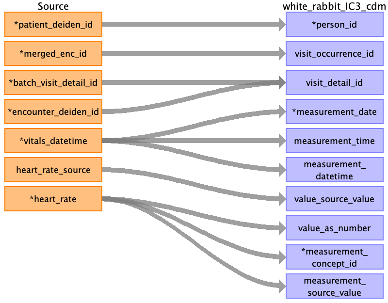
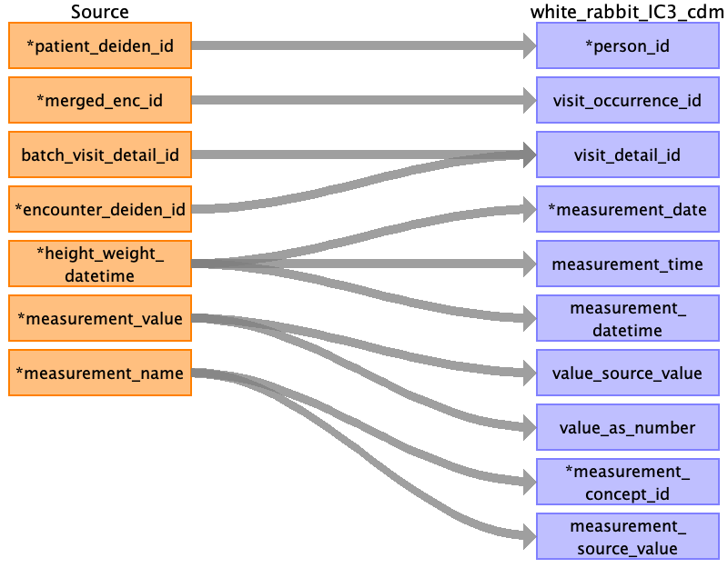
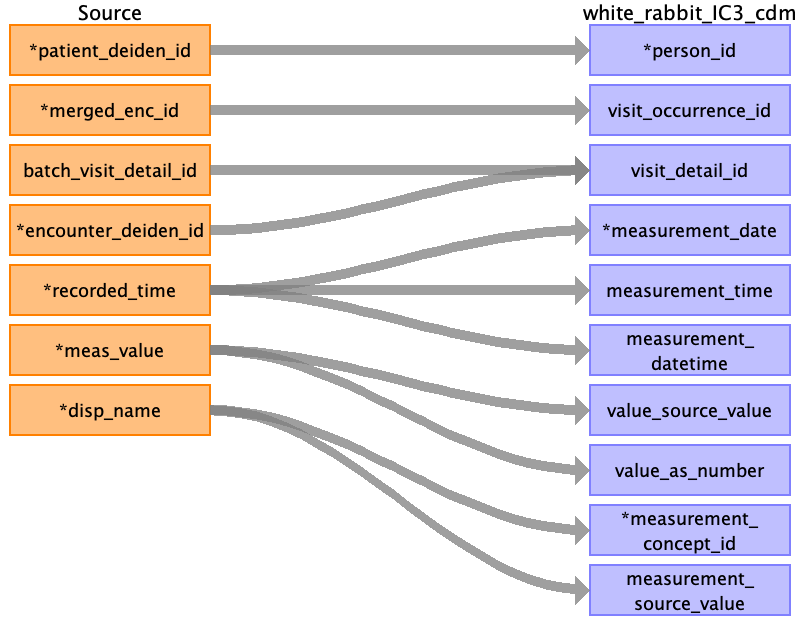
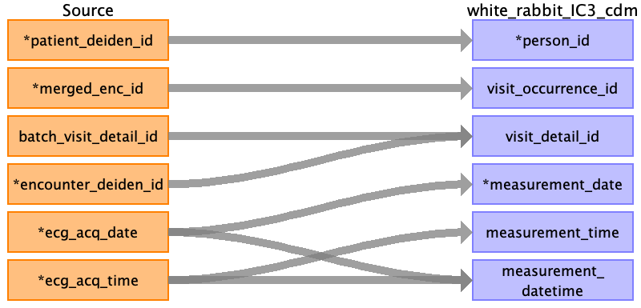
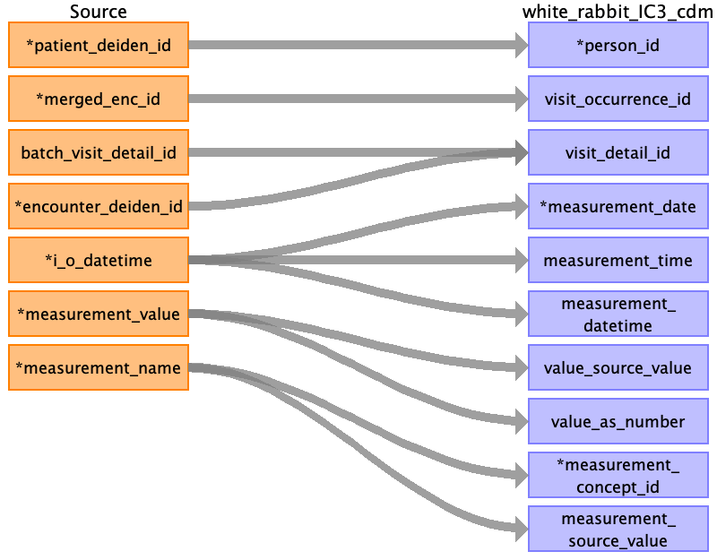

## Table name: measurement

### Reading from blood_pressure_clean_0_0.csv

| Destination Field | Source field | Logic | Comment field |
| --- | --- | --- | --- |
| person_id | patient_deiden_id |  | Person ID is the source ID from IDR after the project name and deidentification database intialization date. |
| visit_occurrence_id | merged_enc_id |  |  |
| visit_detail_id | batch_visit_detail_idencounter_deiden_id |  | Looked up via batch visit detail id if avaialble, else lookup using encounter deiden id, else NULL |
| measurement_date | bp_datetime |  |  |
| measurement_time | bp_datetime |  |  |
| measurement_datetime | bp_datetime |  |  |
| value_source_value | noninvasive_map_source_valuenoninvasive_bp_source_valueinvasive_bp_source_valueinvasive_map_source_value |  | Value of the field is used to populate the fieldValue of the field is used to populate the fieldValue of the field is used to populate the fieldValue of the field is used to populate the fieldValue of the field is used to populate the field |
| value_as_number | cvpcvp_meanpap_meaninvasive_systolicinvasive_diastolicinvasive_mapnoninvasive_systolicnoninvasive_diastolicnoninvasive_map |  | Value of the field is used to populate the field |
| measurement_id |  |  | AUTO INCREMENT |
| measurement_concept_id | cvpcvp_meanpap_meaninvasive_systolicinvasive_diastolicinvasive_mapnoninvasive_systolicnoninvasive_diastolicnoninvasive_mapinvasive_bp_methodnoninvasive_bp_method |  | Name of the field is used to populate the fieldCombination of method and column name (e.g. BP Cuff Systolic) then mapped using excel lookup table. Name of the field is used to populate the field |
| order_number |  |  | Not Populated |
| measurement_type_concept_id |  |  | Filled in as EHR (32817) |
| measurement_source_value | cvpcvp_meanpap_meaninvasive_bp_methodnoninvasive_bp_methodinvasive_systolicinvasive_diastolicinvasive_mapnoninvasive_systolicnoninvasive_diastolicnoninvasive_map |  | Combination of method and column name (e.g. BP Cuff Systolic). Name of the field is used to populate the field |
| unit_concept_id |  |  | Filled in as concept id for mmHG if not in excel lookup table |
| unit_source_value |  |  | mmHG |
| value_as_concept_id |  |  | NOT POPULATED |
| operator_concept_id |  |  | NOT POPULATED |
| range_low |  |  | Not Populated |
| range_high |  |  | Not Populated |
| provider_id |  |  | Not populated |
| measurement_source_concept_id |  |  | Not Populated |
| unit_source_concept_id |  |  | Not Populated |
| measurement_event_id |  |  | Not Populated |
| meas_event_field_concept_id |  |  | Not Populated |

### Reading from sofa_clean_0_0.csv

| Destination Field | Source field | Logic | Comment field |
| --- | --- | --- | --- |
| person_id | patient_deiden_id |  |  |
| visit_occurrence_id | merged_enc_id |  |  |
| visit_detail_id | batch_visit_detail_idencounter_deiden_id |  | Looked up via batch visit detail id if avaialble, else lookup using encounter deiden id, else NULL |
| measurement_date | date_of_care |  |  |
| measurement_time | date_of_care |  |  |
| measurement_datetime | date_of_care |  |  |
| value_source_value | respirationcnscardiovascularlivercoagulationrenalsofa_score |  | Value of the field is used to populate the field |
| value_as_number | respirationcnscardiovascularlivercoagulationrenalsofa_score |  | Value of the field is used to populate the field |
| measurement_id |  |  | AUTO INCREMENT |
| measurement_concept_id | respirationcnscardiovascularlivercoagulationrenalsofa_score |  | Combination of method and column name (e.g. BP Cuff Systolic) then mapped using excel lookup table. Name of the field is used to populate the field |
| order_number |  |  | Not Populated |
| measurement_type_concept_id |  |  | Filled in as EHR (32817) |
| measurement_source_value | respirationcnscardiovascularlivercoagulationrenalsofa_score |  | Combination of method and column name (e.g. BP Cuff Systolic). Name of the field is used to populate the field |
| unit_concept_id |  |  | Filled in as concept id for mmHG if not in excel lookup table |
| unit_source_value |  |  | mmHG |
| value_as_concept_id |  |  | NOT POPULATED |
| operator_concept_id |  |  | NOT POPULATED |
| range_low |  |  | Not Populated |
| range_high |  |  | Not Populated |
| provider_id |  |  | Not populated |
| measurement_source_concept_id |  |  | Not Populated |
| unit_source_concept_id |  |  | Not Populated |
| measurement_event_id |  |  | Not Populated |
| meas_event_field_concept_id |  |  | Not Populated |

### Reading from temperature_clean_0_0.csv

| Destination Field | Source field | Logic | Comment field |
| --- | --- | --- | --- |
| person_id | patient_deiden_id |  |  |
| visit_occurrence_id | merged_enc_id |  |  |
| visit_detail_id | batch_visit_detail_idencounter_deiden_id |  | Looked up via batch visit detail id if avaialble, else lookup using encounter deiden id, else NULL |
| measurement_date | vitals_datetime |  |  |
| measurement_time | vitals_datetime |  |  |
| measurement_datetime | vitals_datetime |  |  |
| value_source_value | temp_source_valuetemp_sourcetemp_source_unit |  | Value of the field is used to populate the field |
| value_as_number | temp_celsiusclean_core_body_temp_celsius |  | Value of the field is used to populate the field |
| measurement_id |  |  | AUTO INCREMENT |
| measurement_concept_id | temp_celsiusclean_core_body_temp_celsius |  | Combination of method and column name (e.g. BP Cuff Systolic) then mapped using excel lookup table. Name of the field is used to populate the field |
| order_number |  |  | Not Populated |
| measurement_type_concept_id |  |  | Filled in as EHR (32817) |
| measurement_source_value | temp_celsiusclean_core_body_temp_celsius |  | Combination of method and column name (e.g. BP Cuff Systolic). Name of the field is used to populate the field |
| unit_concept_id |  |  | Filled in as concept id for mmHG if not in excel lookup table |
| unit_source_value |  |  | mmHG |
| value_as_concept_id |  |  | NOT POPULATED |
| operator_concept_id |  |  | NOT POPULATED |
| range_low |  |  | Not Populated |
| range_high |  |  | Not Populated |
| provider_id |  |  | Not populated |
| measurement_source_concept_id |  |  | Not Populated |
| unit_source_concept_id |  |  | Not Populated |
| measurement_event_id |  |  | Not Populated |
| meas_event_field_concept_id |  |  | Not Populated |

### Reading from anesthesia_clean_0_0.csv

| Destination Field | Source field | Logic | Comment field |
| --- | --- | --- | --- |
| person_id | patient_deiden_id |  |  |
| visit_occurrence_id | merged_enc_id |  |  |
| visit_detail_id | batch_visit_detail_idencounter_deiden_id |  | Looked up via batch visit detail id if avaialble, else lookup using encounter deiden id, else NULL |
| measurement_date | anesthesia_datetime |  |  |
| measurement_time | anesthesia_datetime |  |  |
| measurement_datetime | anesthesia_datetime |  |  |
| value_source_value | bis_index |  | Value of the field is used to populate the field |
| value_as_number | bis_index |  | Value of the field is used to populate the field |
| measurement_id |  |  | AUTO INCREMENT |
| measurement_concept_id | bis_index |  | Combination of method and column name (e.g. BP Cuff Systolic) then mapped using excel lookup table. Name of the field is used to populate the field |
| order_number |  |  | Not Populated |
| measurement_type_concept_id |  |  | Filled in as EHR (32817) |
| measurement_source_value | bis_index |  | Combination of method and column name (e.g. BP Cuff Systolic). Name of the field is used to populate the field |
| unit_concept_id |  |  | Filled in as concept id for mmHG if not in excel lookup table |
| unit_source_value |  |  | mmHG |
| value_as_concept_id |  |  | NOT POPULATED |
| operator_concept_id |  |  | NOT POPULATED |
| range_low |  |  | Not Populated |
| range_high |  |  | Not Populated |
| provider_id |  |  | Not populated |
| measurement_source_concept_id |  |  | Not Populated |
| unit_source_concept_id |  |  | Not Populated |
| measurement_event_id |  |  | Not Populated |
| meas_event_field_concept_id |  |  | Not Populated |

### Reading from heart_rate_clean_0_0.csv

| Destination Field | Source field | Logic | Comment field |
| --- | --- | --- | --- |
| person_id | patient_deiden_id |  |  |
| visit_occurrence_id | merged_enc_id |  |  |
| visit_detail_id | batch_visit_detail_idencounter_deiden_id |  | Looked up via batch visit detail id if avaialble, else lookup using encounter deiden id, else NULL |
| measurement_date | vitals_datetime |  |  |
| measurement_time | vitals_datetime |  |  |
| measurement_datetime | vitals_datetime |  |  |
| value_source_value | heart_rate_source |  | Value of the field is used to populate the field |
| value_as_number | heart_rate |  | Value of the field is used to populate the field |
| measurement_id |  |  | AUTO INCREMENT |
| measurement_concept_id | heart_rate |  | Combination of method and column name (e.g. BP Cuff Systolic) then mapped using excel lookup table. Name of the field is used to populate the field |
| order_number |  |  | Not Populated |
| measurement_type_concept_id |  |  | Filled in as EHR (32817) |
| measurement_source_value | heart_rate |  | Combination of method and column name (e.g. BP Cuff Systolic). Name of the field is used to populate the field |
| unit_concept_id |  |  | Filled in as concept id for mmHG if not in excel lookup table |
| unit_source_value |  |  | mmHG |
| value_as_concept_id |  |  | NOT POPULATED |
| operator_concept_id |  |  | NOT POPULATED |
| range_low |  |  | Not Populated |
| range_high |  |  | Not Populated |
| provider_id |  |  | Not populated |
| measurement_source_concept_id |  |  | Not Populated |
| unit_source_concept_id |  |  | Not Populated |
| measurement_event_id |  |  | Not Populated |
| meas_event_field_concept_id |  |  | Not Populated |

### Reading from height_weight_clean_0_0.csv

| Destination Field | Source field | Logic | Comment field |
| --- | --- | --- | --- |
| person_id | patient_deiden_id |  |  |
| visit_occurrence_id | merged_enc_id |  |  |
| visit_detail_id | batch_visit_detail_idencounter_deiden_id |  | Looked up via batch visit detail id if avaialble, else lookup using encounter deiden id, else NULL |
| measurement_date | height_weight_datetime |  |  |
| measurement_time | height_weight_datetime |  |  |
| measurement_datetime | height_weight_datetime |  |  |
| value_source_value | measurement_value |  | Value of the field is used to populate the field |
| value_as_number | measurement_value |  | Value of the field is used to populate the field |
| measurement_id |  |  | AUTO INCREMENT |
| measurement_concept_id | measurement_name |  | If it is empty, fill with 0 as default value. Else, Name of this field is used to populate the fieldCombination of method and column name (e.g. BP Cuff Systolic) then mapped using excel lookup table. Name of the field is used to populate the field |
| order_number |  |  | Not Populated |
| measurement_type_concept_id |  |  | Filled in as EHR (32817) |
| measurement_source_value | measurement_name |  | Combination of method and column name (e.g. BP Cuff Systolic). Name of the field is used to populate the field |
| unit_concept_id |  |  | Filled in as concept id for mmHG if not in excel lookup table |
| unit_source_value |  |  | mmHG |
| value_as_concept_id |  |  | NOT POPULATED |
| operator_concept_id |  |  | NOT POPULATED |
| range_low |  |  | Not Populated |
| range_high |  |  | Not Populated |
| provider_id |  |  | Not populated |
| measurement_source_concept_id |  |  | Not Populated |
| unit_source_concept_id |  |  | Not Populated |
| measurement_event_id |  |  | Not Populated |
| meas_event_field_concept_id |  |  | Not Populated |

### Reading from mac_components_clean_0_0.csv

| Destination Field | Source field | Logic | Comment field |
| --- | --- | --- | --- |
| person_id | patient_deiden_id |  |  |
| visit_occurrence_id | merged_enc_id |  |  |
| visit_detail_id | batch_visit_detail_idencounter_deiden_id |  | Looked up via batch visit detail id if avaialble, else lookup using encounter deiden id, else NULL |
| measurement_date | recorded_time |  |  |
| measurement_time | recorded_time |  |  |
| measurement_datetime | recorded_time |  |  |
| value_source_value | meas_value |  | Value of the field is used to populate the field |
| value_as_number | meas_value |  | Value of the field is used to populate the field |
| measurement_id |  |  | AUTO INCREMENT |
| measurement_concept_id | disp_name |  | Combination of method and column name (e.g. BP Cuff Systolic) then mapped using excel lookup table. Name of the field is used to populate the field |
| order_number |  |  | Not Populated |
| measurement_type_concept_id |  |  | Filled in as EHR (32817) |
| measurement_source_value | disp_name |  | Combination of method and column name (e.g. BP Cuff Systolic). Name of the field is used to populate the field |
| unit_concept_id |  |  | Filled in as concept id for mmHG if not in excel lookup table |
| unit_source_value |  |  | mmHG |
| value_as_concept_id |  |  | NOT POPULATED |
| operator_concept_id |  |  | NOT POPULATED |
| range_low |  |  | Not Populated |
| range_high |  |  | Not Populated |
| provider_id |  |  | Not populated |
| measurement_source_concept_id |  |  | Not Populated |
| unit_source_concept_id |  |  | Not Populated |
| measurement_event_id |  |  | Not Populated |
| meas_event_field_concept_id |  |  | Not Populated |

### Reading from 60_ecg_cardiology_detail_clean_0_0.csv

| Destination Field | Source field | Logic | Comment field |
| --- | --- | --- | --- |
| person_id | patient_deiden_id |  |  |
| visit_occurrence_id | merged_enc_id |  |  |
| visit_detail_id | batch_visit_detail_idencounter_deiden_id |  | Looked up via batch visit detail id if avaialble, else lookup using encounter deiden id, else NULL |
| measurement_date | ecg_acq_date |  |  |
| measurement_time | ecg_acq_time |  |  |
| measurement_datetime | ecg_acq_dateecg_acq_time |  |  |
| value_source_value |  |  | Value of the field is used to populate the field |
| value_as_number |  |  | Value of the field is used to populate the field |
| measurement_id |  |  | AUTO INCREMENT |
| measurement_concept_id |  |  | Combination of method and column name (e.g. BP Cuff Systolic) then mapped using excel lookup table. Name of the field is used to populate the field |
| order_number |  |  | Not Populated |
| measurement_type_concept_id |  |  | Filled in as EHR (32817) |
| measurement_source_value |  |  | Combination of method and column name (e.g. BP Cuff Systolic). Name of the field is used to populate the field |
| unit_concept_id |  |  | Filled in as concept id for mmHG if not in excel lookup table |
| unit_source_value |  |  | mmHG |
| value_as_concept_id |  |  | NOT POPULATED |
| operator_concept_id |  |  | NOT POPULATED |
| range_low |  |  | Not Populated |
| range_high |  |  | Not Populated |
| provider_id |  |  | Not populated |
| measurement_source_concept_id |  |  | Not Populated |
| unit_source_concept_id |  |  | Not Populated |
| measurement_event_id |  |  | Not Populated |
| meas_event_field_concept_id |  |  | Not Populated |

### Reading from intake_outtake_clean_0_0.csv

| Destination Field | Source field | Logic | Comment field |
| --- | --- | --- | --- |
| person_id | patient_deiden_id |  |  |
| visit_occurrence_id | merged_enc_id |  |  |
| visit_detail_id | batch_visit_detail_idencounter_deiden_id |  | Looked up via batch visit detail id if avaialble, else lookup using encounter deiden id, else NULL |
| measurement_date | i_o_datetime |  |  |
| measurement_time | i_o_datetime |  |  |
| measurement_datetime | i_o_datetime |  |  |
| value_source_value | measurement_value |  | Value of the field is used to populate the field |
| value_as_number | measurement_value |  | Value of the field is used to populate the field |
| measurement_id |  |  | AUTO INCREMENT |
| measurement_concept_id | measurement_name |  | Combination of method and column name (e.g. BP Cuff Systolic) then mapped using excel lookup table. Name of the field is used to populate the field |
| order_number |  |  | Not Populated |
| measurement_type_concept_id |  |  | Filled in as EHR (32817) |
| measurement_source_value | measurement_name |  | Combination of method and column name (e.g. BP Cuff Systolic). Name of the field is used to populate the field |
| unit_concept_id |  |  | Filled in as concept id for mmHG if not in excel lookup table |
| unit_source_value |  |  | mmHG |
| value_as_concept_id |  |  | NOT POPULATED |
| operator_concept_id |  |  | NOT POPULATED |
| range_low |  |  | Not Populated |
| range_high |  |  | Not Populated |
| provider_id |  |  | Not populated |
| measurement_source_concept_id |  |  | Not Populated |
| unit_source_concept_id |  |  | Not Populated |
| measurement_event_id |  |  | Not Populated |
| meas_event_field_concept_id |  |  | Not Populated |

### Reading from q1_sofa_clean_0_0.csv

| Destination Field | Source field | Logic | Comment field |
| --- | --- | --- | --- |
| person_id | patient_deiden_id |  |  |
| visit_occurrence_id | merged_enc_id |  |  |
| visit_detail_id | batch_visit_detail_id |  | Looked up via batch visit detail id if avaialble, else lookup using encounter deiden id, else NULL |
| measurement_date |  |  |  |
| measurement_time | time |  |  |
| measurement_datetime | time |  |  |
| value_source_value | glasgow_coma_adult_scoremap_valuebilirubinplateletscreatininepfspfdopaminerespcoagsofa_scoreliverrenalcnscardio |  | Value of the field is used to populate the field |
| value_as_number | glasgow_coma_adult_scoremap_valuebilirubinplateletscreatininepfspfdopaminerespcoagsofa_scoreliverrenalcnscardio |  | Value of the field is used to populate the field |
| measurement_id | map_valuebilirubinplateletscreatininepfspfdopaminerespcoagsofa_scoreliverrenalcnscardio |  | AUTO INCREMENT |
| measurement_concept_id |  |  | Combination of method and column name (e.g. BP Cuff Systolic) then mapped using excel lookup table. Name of the field is used to populate the field |
| order_number |  |  | Not Populated |
| measurement_type_concept_id |  |  | Filled in as EHR (32817) |
| measurement_source_value |  |  | Combination of method and column name (e.g. BP Cuff Systolic). Name of the field is used to populate the field |
| unit_concept_id |  |  | Filled in as concept id for mmHG if not in excel lookup table |
| unit_source_value |  |  | mmHG |
| value_as_concept_id |  |  | NOT POPULATED |
| operator_concept_id |  |  | NOT POPULATED |
| range_low |  |  | Not Populated |
| range_high |  |  | Not Populated |
| provider_id |  |  | Not populated |
| measurement_source_concept_id |  |  | Not Populated |
| unit_source_concept_id |  |  | Not Populated |
| measurement_event_id |  |  | Not Populated |
| meas_event_field_concept_id |  |  | Not Populated |

