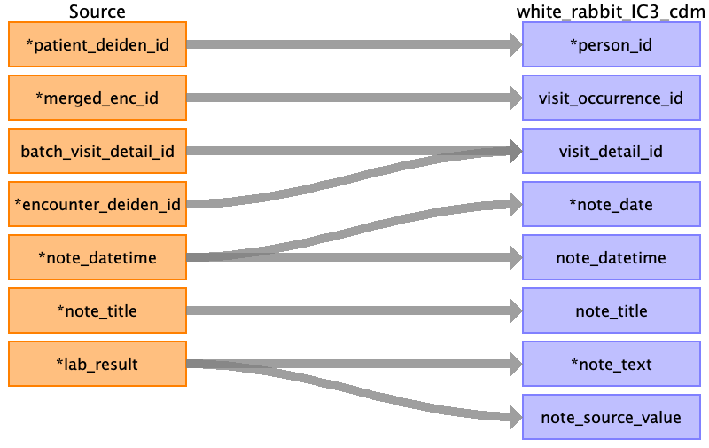

## Table name: note

### Reading from lab_notes_clean_0_0.csv

| Destination Field | Source field | Logic | Comment field |
| --- | --- | --- | --- |
| person_id | patient_deiden_id |  |  |
| visit_occurrence_id | merged_enc_id |  |  |
| visit_detail_id | batch_visit_detail_idencounter_deiden_id |  |  |
| note_id |  |  | Auto increment |
| note_event_id |  |  | Not Populated |
| note_event_field_concept_id |  |  | Not Populated |
| note_date | note_datetime |  |  |
| note_datetime | note_datetime |  |  |
| note_type_concept_id |  |  | Fill with EHR (32817) |
| note_class_concept_id |  |  | Fill with 706371 |
| note_title | note_title |  |  |
| note_text | lab_result |  |  |
| note_source_value | lab_result |  |  |
| encoding_concept_id |  |  | Fill with 0 |
| language_concept_id |  |  | Fill with 4180186 |
| provider_id |  |  | Not Populated |
| order_number |  |  | Order number Deiden_id |
| version_number |  |  | Not Populated |
| signer_provider_id |  |  | Not Populated |
| idr_note_id |  |  | Not Populated |

