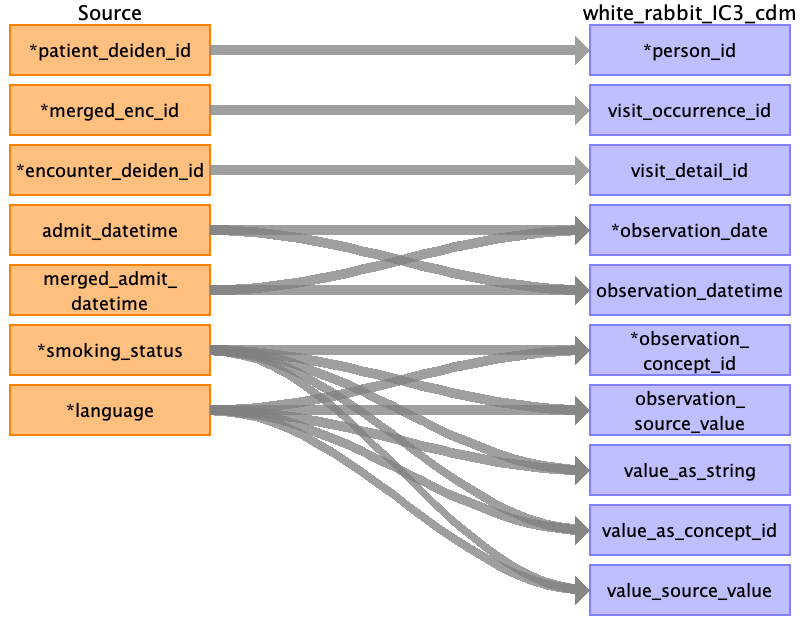
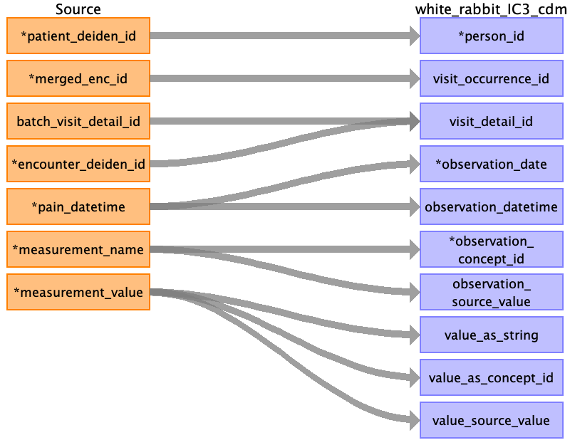
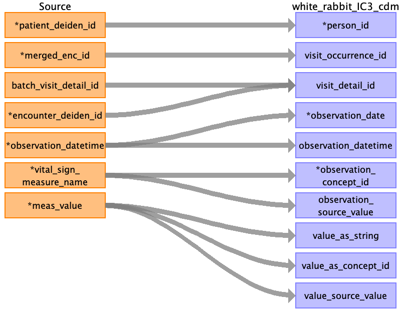
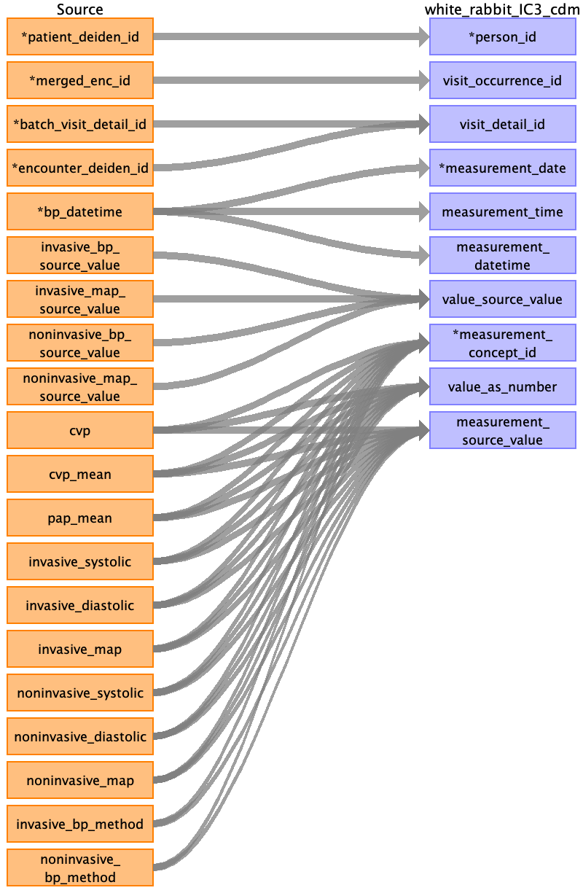
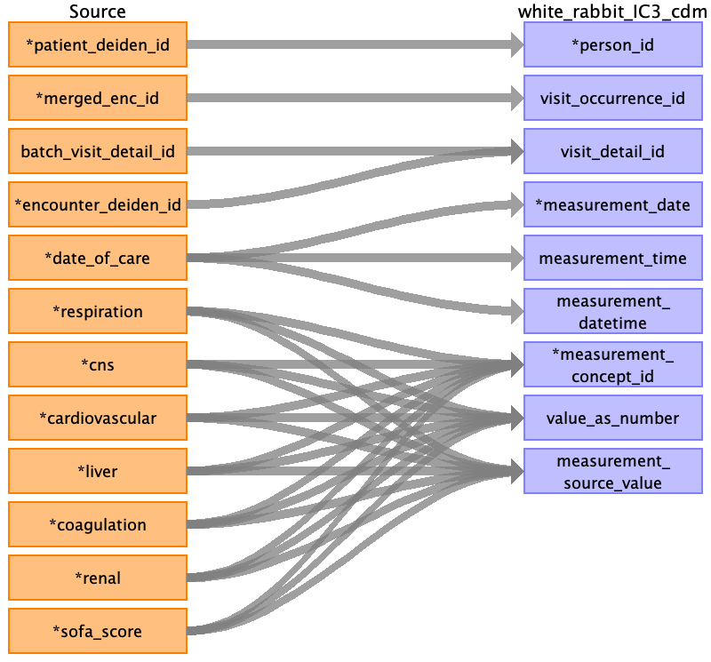
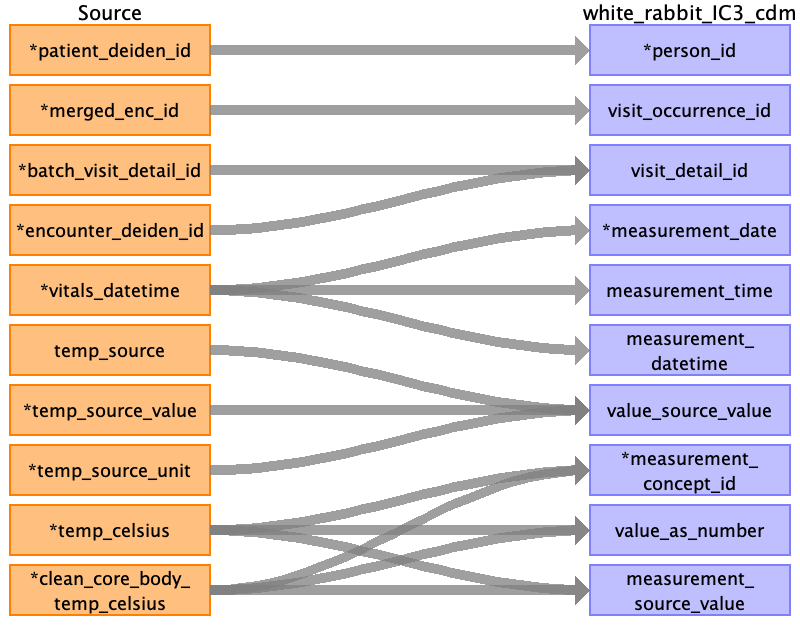
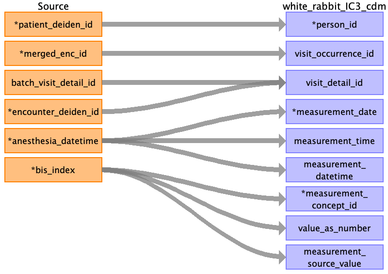

## Table name: observation

### Reading from encounters_clean_0_0.csv

| Destination Field | Source field | Logic | Comment field |
| --- | --- | --- | --- |
| person_id | patient_deiden_id |  | Person ID is the source ID from IDR after the project name and deidentification database intialization date. |
| visit_occurrence_id | merged_enc_id |  |  |
| visit_detail_id | encounter_deiden_id |  | Looked up via batch visit detail id if avaialble, else lookup using encounter deiden id, else NULL |
| observation_date | admit_datetimemerged_admit_datetime |  | observation_date is populated with date from admit_datetime. Please see the sheet map_table for additional mapping detailsobservation_date is populated with date from merged_admit_datetime. Please see the sheet map_table for additional mapping details |
| observation_datetime | admit_datetimemerged_admit_datetime |  | observation_datetime is derived from admit_datetime. Please see the sheet map_table for additional mapping details |
| observation_concept_id | languagesmoking_status |  | Name of this field is used to populate the field |
| observation_source_value | languagesmoking_status |  | Source column name  Name of this field is used to populate the field |
| value_as_string | languagesmoking_status |  | Value of this field is used to populate the field |
| value_as_concept_id | languagesmoking_status |  | Mapped using excel mapping table.  Name of this field is used to populate the field |
| value_source_value | languagesmoking_status |  | source value  Value of this field is used to populate the field |
| observation_id |  |  | AUTO INCREMENT COLUMN |
| observation_type_concept_id |  |  | Use standard concept for EHR DATA 32817. |
| value_as_number |  |  | Not Applicable |
| order_number |  |  | Not Populated |
| observation_source_concept_id |  |  | Not Populated |
| unit_concept_id |  |  | Not Populated |
| observation_event_id |  |  | Not Populated |
| obs_event_field_concept_id |  |  | Not Populated |
| unit_source_value |  |  | Not Populated |
| qualifier_source_value |  |  | Not Populated |
| qualifier_concept_id |  |  | Not Populated |
| provider_id |  |  | Not Populated |

### Reading from blood_pressure_clean_0_0.csv

| Destination Field | Source field | Logic | Comment field |
| --- | --- | --- | --- |
| person_id | patient_deiden_id |  | Person ID is the source ID from IDR after the project name and deidentification database intialization date. |
| visit_occurrence_id | merged_enc_id |  |  |
| visit_detail_id | batch_visit_detail_idencounter_deiden_id |  | Looked up via batch visit detail id if avaialble, else lookup using encounter deiden id, else NULL |
| observation_date | bp_datetime |  |  |
| observation_datetime | bp_datetime |  | observation_datetime is derived from admit_datetime. Please see the sheet map_table for additional mapping details |
| observation_concept_id | bp_locationpatient_position |  | Name of this field is used to populate the field |
| observation_source_value | bp_locationpatient_position |  | Source column name  Name of this field is used to populate the field |
| value_as_string | bp_locationpatient_position |  | Value of this field is used to populate the field |
| value_as_concept_id | bp_locationpatient_position |  | Mapped using excel mapping table.  Name of this field is used to populate the field |
| value_source_value | bp_locationpatient_position |  | source value  Value of this field is used to populate the field |
| observation_id |  |  | AUTO INCREMENT COLUMN |
| observation_type_concept_id |  |  | Use standard concept for EHR DATA 32817. |
| value_as_number |  |  | Not Applicable |
| order_number |  |  | Not Populated |
| observation_source_concept_id |  |  | Not Populated |
| unit_concept_id |  |  | Not Populated |
| observation_event_id |  |  | Not Populated |
| obs_event_field_concept_id |  |  | Not Populated |
| unit_source_value |  |  | Not Populated |
| qualifier_source_value |  |  | Not Populated |
| qualifier_concept_id |  |  | Not Populated |
| provider_id |  |  | Not Populated |

### Reading from morse_clean_0_0.csv

| Destination Field | Source field | Logic | Comment field |
| --- | --- | --- | --- |
| person_id | patient_deiden_id |  | Person ID is the source ID from IDR after the project name and deidentification database intialization date. |
| visit_occurrence_id | merged_enc_id |  |  |
| visit_detail_id | batch_visit_detail_idencounter_deiden_id |  | Looked up via batch visit detail id if avaialble, else lookup using encounter deiden id, else NULL |
| observation_date | morse_datetime |  |  |
| observation_datetime | morse_datetime |  | observation_datetime is derived from admit_datetime. Please see the sheet map_table for additional mapping details |
| observation_concept_id | measurement_name |  | Name of this field is used to populate the field |
| observation_source_value | measurement_name |  | Source column name  Name of this field is used to populate the field |
| value_as_string | measurement_value |  | Value of this field is used to populate the field |
| value_as_concept_id | measurement_value |  | Mapped using excel mapping table.  Name of this field is used to populate the field |
| value_source_value | measurement_value |  | source value  Value of this field is used to populate the field |
| observation_id |  |  | AUTO INCREMENT COLUMN |
| observation_type_concept_id |  |  | Use standard concept for EHR DATA 32817. |
| value_as_number |  |  | Not Applicable |
| order_number |  |  | Not Populated |
| observation_source_concept_id |  |  | Not Populated |
| unit_concept_id |  |  | Not Populated |
| observation_event_id |  |  | Not Populated |
| obs_event_field_concept_id |  |  | Not Populated |
| unit_source_value |  |  | Not Populated |
| qualifier_source_value |  |  | Not Populated |
| qualifier_concept_id |  |  | Not Populated |
| provider_id |  |  | Not Populated |

### Reading from realm_clean_0_0.csv

| Destination Field | Source field | Logic | Comment field |
| --- | --- | --- | --- |
| person_id | patient_deiden_id |  | Person ID is the source ID from IDR after the project name and deidentification database intialization date. |
| visit_occurrence_id | merged_enc_id |  |  |
| visit_detail_id | batch_visit_detail_idencounter_deiden_id |  | Looked up via batch visit detail id if avaialble, else lookup using encounter deiden id, else NULL |
| observation_date | realm_datetime |  |  |
| observation_datetime | realm_datetime |  | observation_datetime is derived from admit_datetime. Please see the sheet map_table for additional mapping details |
| observation_concept_id |  |  | Name of this field is used to populate the field |
| observation_source_value |  |  | Source column name  Name of this field is used to populate the field |
| value_as_string | health_literacy_assessment |  | Value of this field is used to populate the field |
| value_as_concept_id | health_literacy_assessment |  | Mapped using excel mapping table.  Name of this field is used to populate the field |
| value_source_value | health_literacy_assessment |  | source value  Value of this field is used to populate the field |
| observation_id |  |  | AUTO INCREMENT COLUMN |
| observation_type_concept_id |  |  | Use standard concept for EHR DATA 32817. |
| value_as_number |  |  | Not Applicable |
| order_number |  |  | Not Populated |
| observation_source_concept_id |  |  | Not Populated |
| unit_concept_id |  |  | Not Populated |
| observation_event_id |  |  | Not Populated |
| obs_event_field_concept_id |  |  | Not Populated |
| unit_source_value |  |  | Not Populated |
| qualifier_source_value |  |  | Not Populated |
| qualifier_concept_id |  |  | Not Populated |
| provider_id |  |  | Not Populated |

### Reading from asa_scores_clean_0_0.csv

| Destination Field | Source field | Logic | Comment field |
| --- | --- | --- | --- |
| person_id | patient_deiden_id |  | Person ID is the source ID from IDR after the project name and deidentification database intialization date. |
| visit_occurrence_id | merged_enc_id |  |  |
| visit_detail_id | batch_visit_detail_idencounter_deiden_id |  | Looked up via batch visit detail id if avaialble, else lookup using encounter deiden id, else NULL |
| observation_date | asa_date |  |  |
| observation_datetime | asa_date |  | observation_datetime is derived from admit_datetime. Please see the sheet map_table for additional mapping details |
| observation_concept_id | asa_score |  | Fill with 762763Name of this field is used to populate the field |
| observation_source_value |  |  | Source column name  Name of this field is used to populate the field |
| value_as_string | asa_score |  | Value of this field is used to populate the field |
| value_as_concept_id | asa_score |  | Mapped using excel mapping table.  Name of this field is used to populate the field |
| value_source_value | asa_score |  | source value  Value of this field is used to populate the field |
| observation_id |  |  | AUTO INCREMENT COLUMN |
| observation_type_concept_id |  |  | Use standard concept for EHR DATA 32817. |
| value_as_number |  |  | Not Applicable |
| order_number |  |  | Not Populated |
| observation_source_concept_id |  |  | Not Populated |
| unit_concept_id |  |  | Not Populated |
| observation_event_id |  |  | Not Populated |
| obs_event_field_concept_id |  |  | Not Populated |
| unit_source_value |  |  | Not Populated |
| qualifier_source_value |  |  | Not Populated |
| qualifier_concept_id |  |  | Not Populated |
| provider_id |  |  | Not Populated |

### Reading from pain_clean_0_0.csv

| Destination Field | Source field | Logic | Comment field |
| --- | --- | --- | --- |
| person_id | patient_deiden_id |  | Person ID is the source ID from IDR after the project name and deidentification database intialization date. |
| visit_occurrence_id | merged_enc_id |  |  |
| visit_detail_id | batch_visit_detail_idencounter_deiden_id |  | Looked up via batch visit detail id if avaialble, else lookup using encounter deiden id, else NULL |
| observation_date | pain_datetime |  |  |
| observation_datetime | pain_datetime |  | observation_datetime is derived from admit_datetime. Please see the sheet map_table for additional mapping details |
| observation_concept_id | measurement_name |  | Name of this field is used to populate the fieldName of this field is used to populate the field |
| observation_source_value | measurement_name |  | Name of this field is used to populate the fieldSource column name  Name of this field is used to populate the field |
| value_as_string | measurement_value |  | Value of this field is used to populate the field |
| value_as_concept_id | measurement_value |  | Mapped using excel mapping table.  Name of this field is used to populate the field |
| value_source_value | measurement_value |  | source value  Value of this field is used to populate the field |
| observation_id |  |  | AUTO INCREMENT COLUMN |
| observation_type_concept_id |  |  | Use standard concept for EHR DATA 32817. |
| value_as_number |  |  | Not Applicable |
| order_number |  |  | Not Populated |
| observation_source_concept_id |  |  | Not Populated |
| unit_concept_id |  |  | Not Populated |
| observation_event_id |  |  | Not Populated |
| obs_event_field_concept_id |  |  | Not Populated |
| unit_source_value |  |  | Not Populated |
| qualifier_source_value |  |  | Not Populated |
| qualifier_concept_id |  |  | Not Populated |
| provider_id |  |  | Not Populated |

### Reading from cam_clean_0_0.csv

| Destination Field | Source field | Logic | Comment field |
| --- | --- | --- | --- |
| person_id | patient_deiden_id |  | Person ID is the source ID from IDR after the project name and deidentification database intialization date. |
| visit_occurrence_id | merged_enc_id |  |  |
| visit_detail_id | batch_visit_detail_idencounter_deiden_id |  | Looked up via batch visit detail id if avaialble, else lookup using encounter deiden id, else NULL |
| observation_date | recorded_time |  |  |
| observation_datetime | recorded_time |  | observation_datetime is derived from admit_datetime. Please see the sheet map_table for additional mapping details |
| observation_concept_id | vital_sign_measure_name |  | Name of this field is used to populate the fieldName of this field is used to populate the field |
| observation_source_value | vital_sign_measure_name |  | Name of this field is used to populate the fieldSource column name  Name of this field is used to populate the field |
| value_as_string | meas_value |  | Value of this field is used to populate the field |
| value_as_concept_id | meas_value |  | Mapped using excel mapping table.  Name of this field is used to populate the field |
| value_source_value | meas_value |  | source value  Value of this field is used to populate the field |
| observation_id |  |  | AUTO INCREMENT COLUMN |
| observation_type_concept_id |  |  | Use standard concept for EHR DATA 32817. |
| value_as_number |  |  | Not Applicable |
| order_number |  |  | Not Populated |
| observation_source_concept_id |  |  | Not Populated |
| unit_concept_id |  |  | Not Populated |
| observation_event_id |  |  | Not Populated |
| obs_event_field_concept_id |  |  | Not Populated |
| unit_source_value |  |  | Not Populated |
| qualifier_source_value |  |  | Not Populated |
| qualifier_concept_id |  |  | Not Populated |
| provider_id |  |  | Not Populated |

### Reading from braden_clean_0_0.csv

| Destination Field | Source field | Logic | Comment field |
| --- | --- | --- | --- |
| person_id | patient_deiden_id |  | Person ID is the source ID from IDR after the project name and deidentification database intialization date. |
| visit_occurrence_id | merged_enc_id |  |  |
| visit_detail_id | batch_visit_detail_idencounter_deiden_id |  | Looked up via batch visit detail id if avaialble, else lookup using encounter deiden id, else NULL |
| observation_date | braden_datetime |  |  |
| observation_datetime | braden_datetime |  | observation_datetime is derived from admit_datetime. Please see the sheet map_table for additional mapping details |
| observation_concept_id | measurement_name |  | Name of this field is used to populate the fieldName of this field is used to populate the field |
| observation_source_value | measurement_name |  | Name of this field is used to populate the fieldSource column name  Name of this field is used to populate the field |
| value_as_string | measurement_value |  | Value of this field is used to populate the field |
| value_as_concept_id | measurement_value |  | Mapped using excel mapping table.  Name of this field is used to populate the field |
| value_source_value | measurement_value |  | source value  Value of this field is used to populate the field |
| observation_id |  |  | AUTO INCREMENT COLUMN |
| observation_type_concept_id |  |  | Use standard concept for EHR DATA 32817. |
| value_as_number |  |  | Not Applicable |
| order_number |  |  | Not Populated |
| observation_source_concept_id |  |  | Not Populated |
| unit_concept_id |  |  | Not Populated |
| observation_event_id |  |  | Not Populated |
| obs_event_field_concept_id |  |  | Not Populated |
| unit_source_value |  |  | Not Populated |
| qualifier_source_value |  |  | Not Populated |
| qualifier_concept_id |  |  | Not Populated |
| provider_id |  |  | Not Populated |

### Reading from mobility_clean_0_0.csv

| Destination Field | Source field | Logic | Comment field |
| --- | --- | --- | --- |
| person_id | patient_deiden_id |  |  |
| visit_occurrence_id | merged_enc_id |  |  |
| visit_detail_id | batch_visit_detail_idencounter_deiden_id |  | Looked up via batch visit detail id if avaialble, else lookup using encounter deiden id, else NULL |
| observation_date | recorded_time |  |  |
| observation_datetime | recorded_time |  | observation_datetime is derived from admit_datetime. Please see the sheet map_table for additional mapping details |
| observation_concept_id | measure_name |  | Name of this field is used to populate the fieldName of this field is used to populate the field |
| observation_source_value | measure_name |  | Name of this field is used to populate the fieldSource column name  Name of this field is used to populate the field |
| value_as_string | meas_value |  | Value of this field is used to populate the field |
| value_as_concept_id | meas_value |  | Mapped using excel mapping table.  Name of this field is used to populate the field |
| value_source_value | meas_value |  | source value  Value of this field is used to populate the field |
| observation_id |  |  | AUTO INCREMENT COLUMN |
| observation_type_concept_id |  |  | Use standard concept for EHR DATA 32817. |
| value_as_number |  |  | Not Applicable |
| order_number |  |  | Not Populated |
| observation_source_concept_id |  |  | Not Populated |
| unit_concept_id |  |  | Not Populated |
| observation_event_id |  |  | Not Populated |
| obs_event_field_concept_id |  |  | Not Populated |
| unit_source_value |  |  | Not Populated |
| qualifier_source_value |  |  | Not Populated |
| qualifier_concept_id |  |  | Not Populated |
| provider_id |  |  | Not Populated |

### Reading from glasgow_clean_0_0.csv

| Destination Field | Source field | Logic | Comment field |
| --- | --- | --- | --- |
| person_id | patient_deiden_id |  |  |
| visit_occurrence_id | merged_enc_id |  |  |
| visit_detail_id | batch_visit_detail_idencounter_deiden_id |  | Looked up via batch visit detail id if avaialble, else lookup using encounter deiden id, else NULL |
| observation_date | glasgow_coma_datetime |  |  |
| observation_datetime | glasgow_coma_datetime |  | observation_datetime is derived from admit_datetime. Please see the sheet map_table for additional mapping details |
| observation_concept_id | measurement_name |  | Name of this field is used to populate the field |
| observation_source_value | measurement_name |  | Source column name  Name of this field is used to populate the field |
| value_as_string | measurement_value |  | Value of this field is used to populate the field |
| value_as_concept_id | measurement_value |  | Mapped using excel mapping table.  Name of this field is used to populate the field |
| value_source_value | measurement_value |  | source value  Value of this field is used to populate the field |
| observation_id |  |  | AUTO INCREMENT COLUMN |
| observation_type_concept_id |  |  | Use standard concept for EHR DATA 32817. |
| value_as_number |  |  | Not Applicable |
| order_number |  |  | Not Populated |
| observation_source_concept_id |  |  | Not Populated |
| unit_concept_id |  |  | Not Populated |
| observation_event_id |  |  | Not Populated |
| obs_event_field_concept_id |  |  | Not Populated |
| unit_source_value |  |  | Not Populated |
| qualifier_source_value |  |  | Not Populated |
| qualifier_concept_id |  |  | Not Populated |
| provider_id |  |  | Not Populated |

### Reading from mews_clean_0_0.csv

| Destination Field | Source field | Logic | Comment field |
| --- | --- | --- | --- |
| person_id | patient_deiden_id |  |  |
| visit_occurrence_id | merged_enc_id |  |  |
| visit_detail_id | batch_visit_detail_idencounter_deiden_id |  | Looked up via batch visit detail id if avaialble, else lookup using encounter deiden id, else NULL |
| observation_date | recorded_time |  |  |
| observation_datetime | recorded_time |  | observation_datetime is derived from admit_datetime. Please see the sheet map_table for additional mapping details |
| observation_concept_id | disp_name |  | Name of this field is used to populate the field |
| observation_source_value | disp_name |  | Source column name  Name of this field is used to populate the field |
| value_as_string | meas_value |  | Value of this field is used to populate the field |
| value_as_concept_id | meas_value |  | Mapped using excel mapping table.  Name of this field is used to populate the field |
| value_source_value | meas_value |  | source value  Value of this field is used to populate the field |
| observation_id |  |  | AUTO INCREMENT COLUMN |
| observation_type_concept_id |  |  | Use standard concept for EHR DATA 32817. |
| value_as_number |  |  | Not Applicable |
| order_number |  |  | Not Populated |
| observation_source_concept_id |  |  | Not Populated |
| unit_concept_id |  |  | Not Populated |
| observation_event_id |  |  | Not Populated |
| obs_event_field_concept_id |  |  | Not Populated |
| unit_source_value |  |  | Not Populated |
| qualifier_source_value |  |  | Not Populated |
| qualifier_concept_id |  |  | Not Populated |
| provider_id |  |  | Not Populated |

### Reading from rass_clean_0_0.csv

| Destination Field | Source field | Logic | Comment field |
| --- | --- | --- | --- |
| person_id | patient_deiden_id |  |  |
| visit_occurrence_id | merged_enc_id |  |  |
| visit_detail_id | batch_visit_detail_idencounter_deiden_id |  | Looked up via batch visit detail id if avaialble, else lookup using encounter deiden id, else NULL |
| observation_date | recorded_time |  |  |
| observation_datetime | recorded_time |  | observation_datetime is derived from admit_datetime. Please see the sheet map_table for additional mapping details |
| observation_concept_id | vital_sign_measure_name |  | Name of this field is used to populate the fieldName of this field is used to populate the field |
| observation_source_value | vital_sign_measure_name |  | Name of this field is used to populate the fieldSource column name  Name of this field is used to populate the field |
| value_as_string | meas_value |  | Value of this field is used to populate the field |
| value_as_concept_id | meas_value |  | Mapped using excel mapping table.  Name of this field is used to populate the field |
| value_source_value | meas_value |  | source value  Value of this field is used to populate the field |
| observation_id |  |  | AUTO INCREMENT COLUMN |
| observation_type_concept_id |  |  | Use standard concept for EHR DATA 32817. |
| value_as_number |  |  | Not Applicable |
| order_number |  |  | Not Populated |
| observation_source_concept_id |  |  | Not Populated |
| unit_concept_id |  |  | Not Populated |
| observation_event_id |  |  | Not Populated |
| obs_event_field_concept_id |  |  | Not Populated |
| unit_source_value |  |  | Not Populated |
| qualifier_source_value |  |  | Not Populated |
| qualifier_concept_id |  |  | Not Populated |
| provider_id |  |  | Not Populated |

### Reading from dialysis_clean_0_0.csv

| Destination Field | Source field | Logic | Comment field |
| --- | --- | --- | --- |
| person_id | patient_deiden_id |  |  |
| visit_occurrence_id | merged_enc_id |  |  |
| visit_detail_id | batch_visit_detail_idencounter_deiden_id |  | Looked up via batch visit detail id if avaialble, else lookup using encounter deiden id, else NULL |
| observation_date | observation_datetime |  |  |
| observation_datetime | observation_datetime |  | observation_datetime is derived from admit_datetime. Please see the sheet map_table for additional mapping details |
| observation_concept_id | vital_sign_measure_name |  | Name of this field is used to populate the field |
| observation_source_value | vital_sign_measure_name |  | Source column name  Name of this field is used to populate the field |
| value_as_string | meas_value |  | Value of this field is used to populate the field |
| value_as_concept_id | meas_value |  | Mapped using excel mapping table.  Name of this field is used to populate the field |
| value_source_value | meas_value |  | source value  Value of this field is used to populate the field |
| observation_id |  |  | AUTO INCREMENT COLUMN |
| observation_type_concept_id |  |  | Use standard concept for EHR DATA 32817. |
| value_as_number |  |  | Not Applicable |
| order_number |  |  | Not Populated |
| observation_source_concept_id |  |  | Not Populated |
| unit_concept_id |  |  | Not Populated |
| observation_event_id |  |  | Not Populated |
| obs_event_field_concept_id |  |  | Not Populated |
| unit_source_value |  |  | Not Populated |
| qualifier_source_value |  |  | Not Populated |
| qualifier_concept_id |  |  | Not Populated |
| provider_id |  |  | Not Populated |

