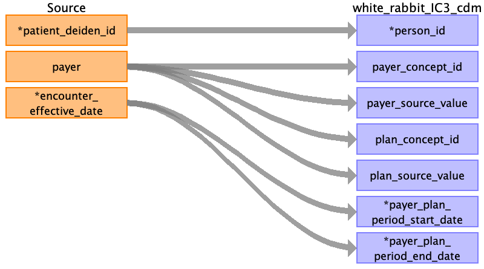

## Table name: payer_plan_period

### Reading from encounters_clean_0_0.csv

| Destination Field | Source field | Logic | Comment field |
| --- | --- | --- | --- |
| person_id | patient_deiden_id |  |  |
| payer_concept_id | payer |  | Name of this field is used to populate the field |
| payer_source_value | payer |  | Value of this field is used to populate the field |
| plan_concept_id | payer |  |  |
| plan_source_value | payer |  |  |
| payer_plan_period_id |  |  | Auto increment |
| payer_plan_period_start_date | encounter_effective_date |  |  |
| payer_plan_period_end_date | encounter_effective_date |  | After stacking |
| payer_source_concept_id |  |  | Not Populated |
| plan_source_concept_id |  |  | Not Populated |
| sponsor_concept_id |  |  | Not Populated |
| sponsor_source_value |  |  | Not Populated |
| sponsor_source_concept_id |  |  | Not Populated |
| family_source_value |  |  | Not Populated |
| stop_reason_concept_id |  |  | Not Populated |
| stop_reason_source_value |  |  | Not Populated |
| stop_reason_source_concept_id |  |  | Not Populated |

