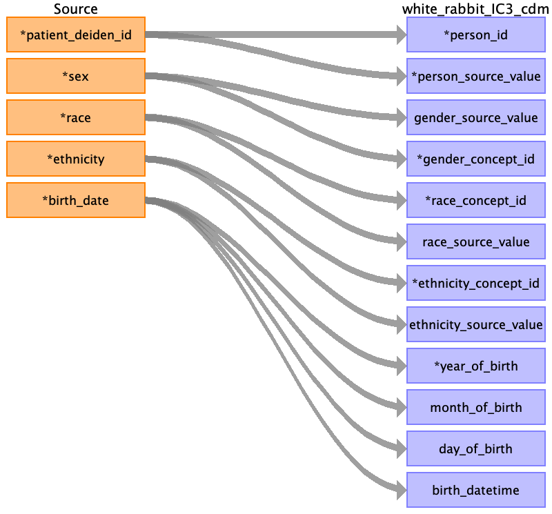

## Table name: person

### Reading from encounters_clean_0_0.csv

| Destination Field | Source field | Logic | Comment field |
| --- | --- | --- | --- |
| person_id | patient_deiden_id |  | Person ID is the source ID from IDR after the project name and deidentification database intialization date.  |
| person_source_value | patient_deiden_id |  | Person Source Value is the source ID from IDR after the project name and deidentification database intialization date.  |
| gender_source_value | sex |  | Populated using the most recent sex.  |
| gender_concept_id | sex |  | Populated using a curated map table based on the gender_source_value. If the value is null then it is defaulted to 0  |
| race_concept_id | race |  | Populated using a curated map table based on the race_source_value.  |
| race_source_value | race |  | Populated using the most recent value that is NOT IN ('PATIENT REFUSED', 'UNKNOWN'). |
| ethnicity_concept_id | ethnicity |  | Populated using a curated map table based on the ethnicity_source value.  |
| ethnicity_source_value | ethnicity |  | Populated using the most recent value that is NOT IN ('PATIENT REFUSED', 'UNKNOWN'). |
| year_of_birth | birth_date |  | Year_of_birth is derived from birth_date. Please see the sheet map_table for additional mapping details  |
| month_of_birth | birth_date |  | month_of_birth is derived from birth_date. Please see the sheet map_table for additional mapping details  |
| day_of_birth | birth_date |  | day_of_birth is derived from birth_date. Please see the sheet map_table for additional mapping details  |
| birth_datetime | birth_date |  | Use birth_date to populate birth_datetime and default the time to midnight |
| location_id |  |  | Populated using most recent city,zip, state from the zip 9 or encounters file |
| provider_id |  |  | Not populated |
| care_site_id |  |  | Not Populated |
| gender_source_concept_id |  |  | Not populated |
| race_source_concept_id |  |  | Not populated |
| ethnicity_source_concept_id |  |  | Not Populated |

