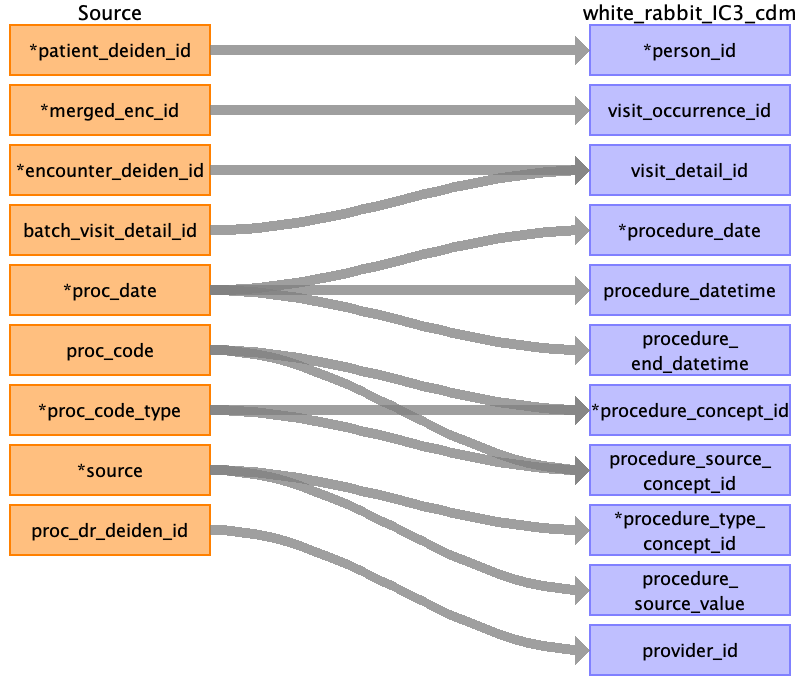

## Table name: procedure_occurrence

### Reading from procedures_clean_0_0.csv

| Destination Field | Source field | Logic | Comment field |
| --- | --- | --- | --- |
| person_id | patient_deiden_id |  |  |
| visit_occurrence_id | merged_enc_id |  |  |
| visit_detail_id | encounter_deiden_id batch_visit_detail_id |  |  |
| procedure_occurrence_id |  |  |  |
| procedure_date | proc_date |  |  |
| procedure_datetime | proc_date |  |  |
| procedure_end_datetime | proc_date |  |  |
| procedure_concept_id | proc_code proc_code_type |  |  |
| procedure_type_concept_id | source |  | Fill value 32817 as default  |
| procedure_source_value | source |  | Value of this field is used to populate the field  |
| provider_id | proc_dr_deiden_id |  |  |
| modifier_concept_id |  |  |  |
| quantity |  |  | Fill value 1 as default |
| procedure_source_concept_id |  |  |  |
| modifier_source_value |  |  | Not Populated |
| procedure_status_source_value |  |  |  |
| procedure_status_concept_id |  |  | Not Populated |
| order_number |  |  | Not Populated |

