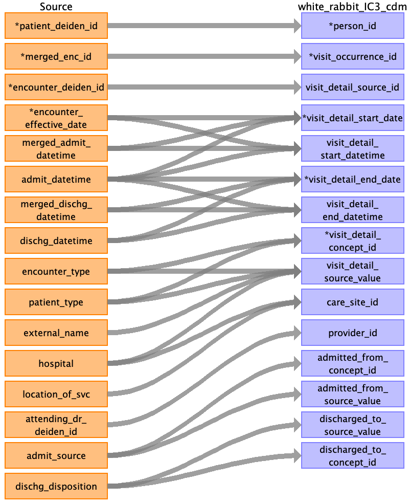

## Table name: visit_detail

### Reading from encounters_clean_0_0.csv

| Destination Field | Source field | Logic | Comment field |
| --- | --- | --- | --- |
| person_id | patient_deiden_id |  | Person ID is the source ID from IDR after the project name and deidentification database intialization date.  |
| visit_occurrence_id | merged_enc_id |  |  |
| visit_detail_source_id | encounter_deiden_id |  | Populate encounter_deiden_id value |
| visit_detail_id |  |  |  |
| visit_detail_concept_id | encounter_type patient_type |  | The visit_detail_concept_id is derived from a curated map table based on the concatation of the patient and encounter types. Please see the sheet map_table for additional mapping details. |
| visit_detail_start_date | admit_datetime encounter_effective_date merged_admit_datetime |  | visit_detail_start_date is derived from admit_datetime. Please see the sheet map_table for additional mapping details When admit_datetime is null, populate visit_detail_start_date with encounter_effective_date   |
| visit_detail_start_datetime | admit_datetime encounter_effective_date merged_admit_datetime |  | visit_detail_start_datetime comes from admit_datetime. Please see the sheet map_table for additional mapping details When admit_datetime is null, populate visit_detail_start_datetime with encounter_effective_date and default time to midnight   |
| visit_detail_end_date | merged_dischg_datetime dischg_datetime admit_datetime |  | visit_detail_end_date will be populated with the date derived from  dischg_datetime If Dischg_datetime is null then populate visit_detail_end_date with the date derived from admit_datetime  |
| visit_detail_end_datetime | merged_dischg_datetime dischg_datetime admit_datetime |  | If discharge datetime is not 23:59, then populate visit_detail_end_datetime as dischg_datetime If Dischg_datetime is null(i.e; when missing or when time in Dischg_datetime is 23:59) then populate visit_detail_end_datetime with   admit_datetime  |
| visit_detail_source_value | encounter_type patient_type hospital external_name |  | This is a combination of patient type, encounter type, hospital, and external name. |
| care_site_id | location_of_svc hospital |  | Use combination of location_of_svc and hospital to lookup care site id |
| visit_detail_type_concept_id |  |  | Use standard concept for EHR DATA 32817. |
| provider_id | attending_dr_deiden_id |  | Populate attending_dr_deiden_id value |
| admitted_from_concept_id | admit_source |  |  |
| admitted_from_source_value | admit_source |  |  |
| discharged_to_source_value | dischg_disposition |  |  |
| admitted_from_site_id |  |  | Not Populated |
| discharged_to_concept_id | dischg_disposition |  | The discharge to Concept ID is derived from discharge disposition. Please see the sheet map_table for additional mapping details.  |
| discharged_to_site_id |  |  | Not Populated |
| or_case_num |  |  |  |
| care_site_type_concept_id |  |  | Not Populated |
| visit_detail_source_concept_id |  |  | Not Populated |
| preceding_visit_detail_id |  |  | Populated through SQL |
| parent_visit_detail_id |  |  | Not populated |

### Reading from internal_stations_clean_0_0.csv

| Destination Field | Source field | Logic | Comment field |
| --- | --- | --- | --- |
| person_id | patient_deiden_id |  |  |
| visit_occurrence_id | merged_enc_id |  |  |
| visit_detail_source_id | encounter_deiden_id |  | Populate encounter_deiden_id value |
| visit_detail_id | batch_visit_detail_id encounter_deiden_id |  |  |
| visit_detail_concept_id |  |  | The visit_detail_concept_id is derived from a curated map table based on the concatation of the patient and encounter types. Please see the sheet map_table for additional mapping details. |
| visit_detail_start_date | enter_datetime |  |  |
| visit_detail_start_datetime | enter_datetime |  |  |
| visit_detail_end_date | exit_datetime |  |  |
| visit_detail_end_datetime | exit_datetime |  |  |
| visit_detail_source_value | at_station |  | This is a combination of patient type, encounter type, hospital, and external name. |
| care_site_id | at_station |  | Use combination of location_of_svc and hospital to lookup care site id |
| visit_detail_type_concept_id |  |  | Use standard concept for EHR DATA 32817. |
| provider_id |  |  | Populate attending_dr_deiden_id value |
| admitted_from_concept_id | from_station |  |  |
| admitted_from_source_value | from_station |  |  |
| discharged_to_source_value | from_station |  |  |
| admitted_from_site_id | from_station |  | Not Populated |
| discharged_to_concept_id | from_station |  |  |
| discharged_to_site_id | to_station |  | Not Populated |
| or_case_num |  |  |  |
| care_site_type_concept_id |  |  | Not Populated |
| visit_detail_source_concept_id |  |  | Not Populated |
| preceding_visit_detail_id |  |  | Populated through SQL |
| parent_visit_detail_id |  |  | Not populated |

