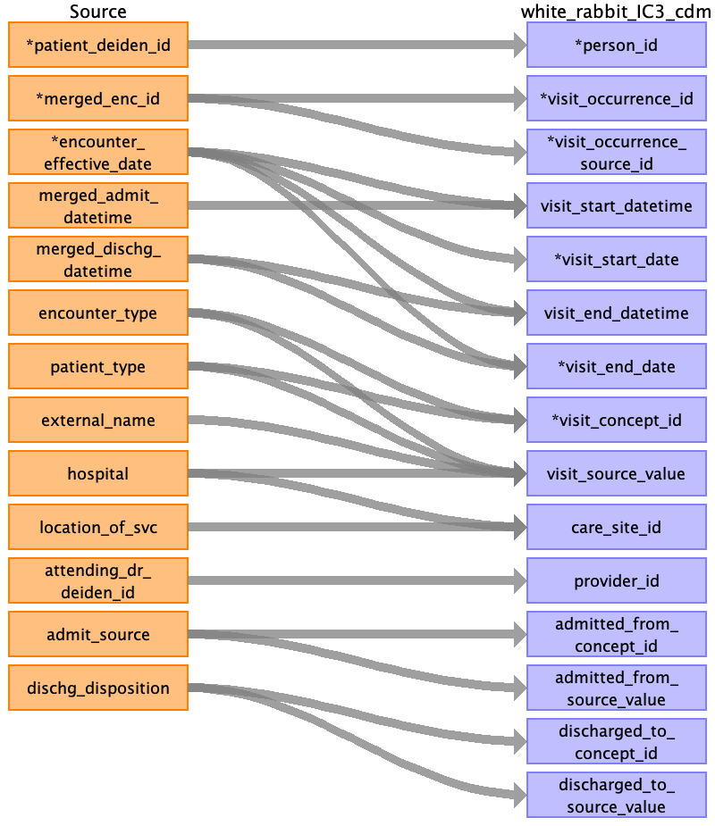

## Table name: visit_occurrence

### Reading from encounters_clean_0_0.csv

| Destination Field | Source field | Logic | Comment field |
| --- | --- | --- | --- |
| person_id | patient_deiden_id |  | Patient ID is the numeric component of the souce ID from IDR after the project name and deidentification database intialization date.  |
| visit_occurrence_id | merged_enc_id |  | AUTO INCREMENT COLUMN based on visit_occurrence_source_id  |
| visit_occurrence_source_id | merged_enc_id |  | Source Visit Occurrence ID. This represents an aggregated encounter_deiden_id for identify hospital and ambulatory episodes. |
| visit_concept_id | patient_type encounter_type |  | The Visit Concept ID is derived from a curated map table based on the concatation of the patient and encounter types. Please see the sheet map_table for additional mapping details. |
| visit_source_value | external_name hospital patient_type encounter_type |  | This is a combination of patient type, encounter type, hospital, and external name. |
| care_site_id | location_of_svc hospital |  | Use combination of location_of_svc and hospital to lookup care site id |
| visit_start_datetime | encounter_effective_date merged_admit_datetime |  | Use encounter effective date when admit_datetime is NULL and default to midnight.   |
| visit_start_date | encounter_effective_date |  |  |
| visit_end_datetime | encounter_effective_date merged_dischg_datetime |  | Use if discharge date is NULL impute time as 23:59.   |
| visit_end_date | encounter_effective_date merged_dischg_datetime |  | Use if discharge date is NULL.   |
| provider_id | attending_dr_deiden_id |  |  |
| admitted_from_concept_id | admit_source |  | Mapped using curated The Admitted FROM Concept ID is derived from admit source. Please see the sheet map_table for additional mapping details. |
| admitted_from_source_value | admit_source |  |  |
| discharged_to_concept_id | dischg_disposition |  | The discharge to Concept ID is derived from discharge disposition. Please see the sheet map_table for additional mapping details.  |
| discharged_to_source_value | dischg_disposition |  |  |
| visit_type_concept_id |  |  | Use standard concept for EHR DATA 32817. |
| visit_source_concept_id |  |  | Not populated |
| preceding_visit_occurrence_id |  |  | Populated at end of ETL by SQL Script. |

