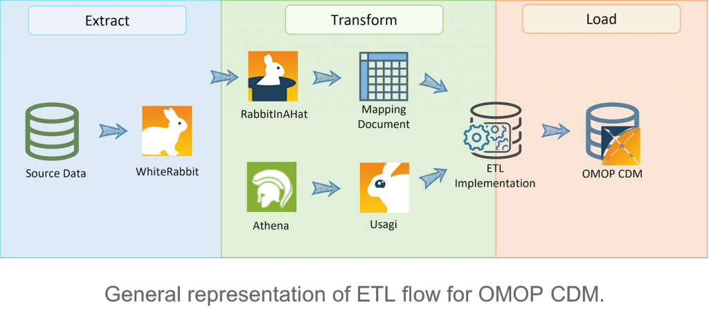

:::tip

To emphasize the mapping contents, we separate the siderbars. Click [here](/resources/OMOP/Introduction) will return to main menu. 

:::

## Tools and ETL process
 

Here are some tools used in ETL process: 
- [WhiteRabbit](https://github.com/OHDSI/WhiteRabbit): scans the source database and creates a report with the information associated with each table, while also extracting some simple analytics about the source fields.
- [Rabbit In a Hat](https://github.com/OHDSI/WhiteRabbit): relies on the generated report by WhiteRabbit and it is where the mapping between source and target tables is done. 
- [Athena](https://athena.ohdsi.org/): used to fetch the Vocabularies. Note that some may require a license, such as the CPT4 vocabulary, for which an UMLS account is needed.
- [Usagi](https://github.com/OHDSI/Usagi): to map source names that do not have a corresponding standard concept, which happens for example when using a specific term in a given language, such as Portuguese. Alongside with a translation mechanism between Portuguese to English, Usagi can be used to find a similar condition in the current concepts and register it in the CDM.
- [DataQualityDashboards](https://github.com/OHDSI/DataQualityDashboard): Once source data is converted to the OMOP CDM tables, quality metrics can be computed to assure that the process of standardization occurred without errors, for example, to check the plausibility of the values inserted. If the data does not meet the quality criteria expected, some changes need to be made in the previous steps, which places ETL as an iterative process.
- [**In-house developed pipelines**](https://github.com/Prisma-pResearch/OMOP/tree/main/IDR_to_OMOP/Python) : To acceleate the mapping process in the future, we create the python pipelines to resolve the tasks. 

## Mapping mechanism

There are two different mappings we try to build up.

### **IC3 customized mapping**
> Based on our research requests, we not only map the standardized medical records into OMOP CDM, but also create some customized concepts, columns and architecture to record more levels of data.

### **[Epic](https://www.epic.com/) flowsheet mapping**
> OMOP mapping from Epic flowsheet to OMOP CDM.

Will implement ...

